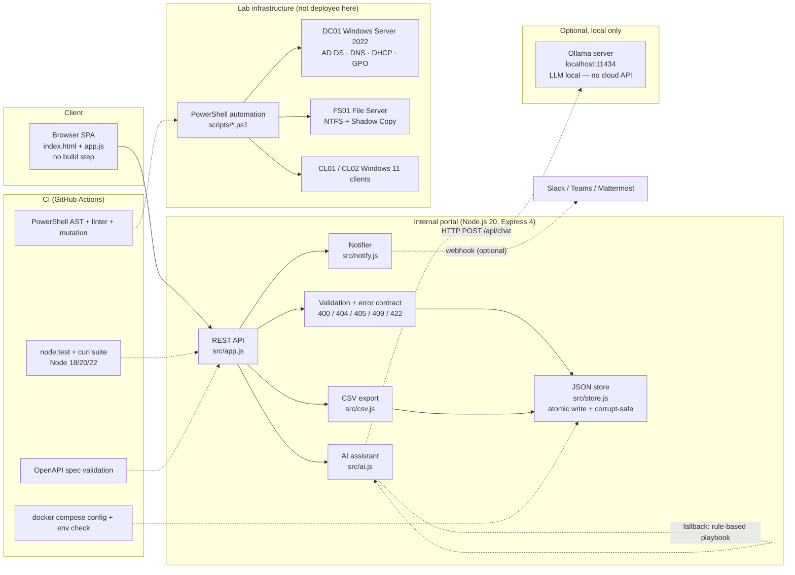
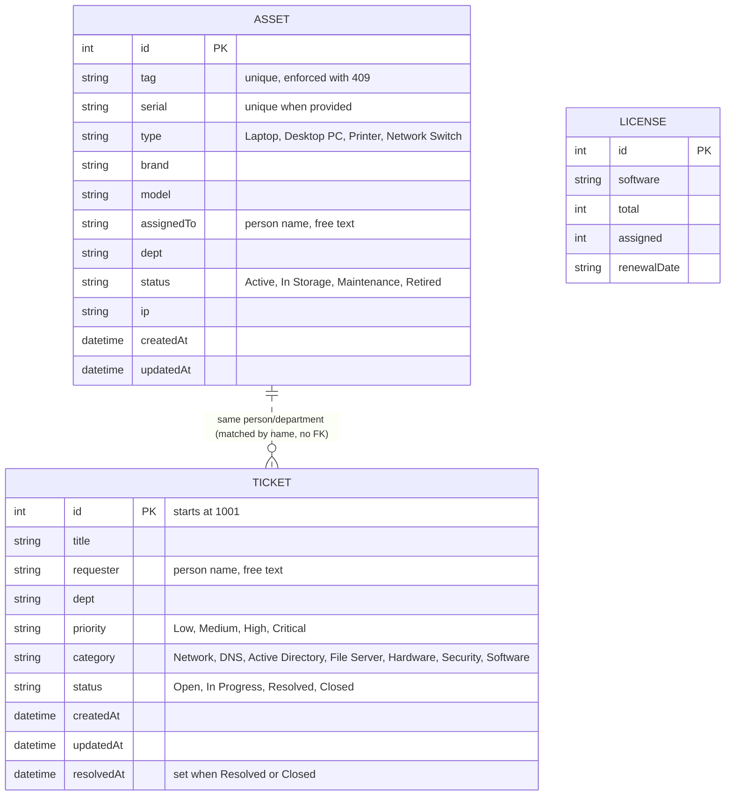

# 🏢 Enterprise IT Helpdesk Lab

A hands‑on lab that simulates an **enterprise IT Helpdesk** on Windows Server 2022, with measurable artifacts:

- **Test Coverage**: 106 unit/integration tests + 68 curl API tests – **0 failures** (verified this session).
- **Demo Data** (running container): 6 assets, 6 tickets, 4 licenses.
- **CI Status**: GitHub Actions (4 jobs / 6 checks) green on Node 18/20/22.
- **PowerShell Automation**: 3 scripts parsed with the official PowerShell AST parser – **0 parse errors**.
- **Dockerised**: non‑root, read‑only rootfs, dropped capabilities, healthcheck.

## Quick Start (under 2 min)
```bash
# Clone & run the portal (fastest)
git clone https://github.com/imtarget05/Enterprise-IT-Helpdesk-Lab.git
cd Enterprise-IT-Helpdesk-Lab/internal-portal
npm ci && npm start   # → http://localhost:3000
```
Or launch the production environment with Docker:
```bash
cd internal-portal
docker compose up -d --wait   # http://localhost:3000
```

## Core Features (key numbers)
- **Dashboard** – KPI cards for total devices, allocated devices, open tickets, resolved tickets.
- **Asset Management** – Unique Asset‑Tag & Serial enforcement (409 on duplicate), CSV export (RFC‑4180, UTF‑8 BOM) ready for Excel.
- **Ticket System** – priority/category lifecycle (Open → In Progress → Resolved/Closed) with automatic High/Critical alerting (audit log + optional webhook); 20 ITIL-style runbooks in `tickets/`.
- **AI Assistant** – Local LLM (Ollama) analyses tickets; falls back to rule‑based playbooks.
- **PowerShell Tools** – User provisioning, asset audit, network health checks.

## Running the Test Suite
```bash
cd internal-portal
npm test                # 106 tests – all pass
./test-api.sh           # 68 curl tests – all pass
bash ../scripts/verify-ps1-syntax.sh   # 3 PowerShell scripts parsed without error
```
All tests must report **0 failures**.

## Quick Links

- Lab topology & VM config – `docs/01-lab-topology-vmware.md`
- AD / DNS / DHCP setup – `docs/02-ad-dns-dhcp-setup.md`
- GPO security matrix – `docs/03-gpo-security-matrix.md`
- Ticket examples – `tickets/` (20 ITIL cases)
- MIT License – [`LICENSE`](LICENSE)

---

## Detailed Sections (§1–§20)

A hands-on **enterprise IT support lab + internal IT asset/helpdesk tool** that replaces manual, spreadsheet-based IT asset tracking and free-text incident handling with a documented ITIL process, automation scripts and a small internal web application.

`Internal IT tooling / automated IT operations` that solves `manual IT asset tracking, undocumented incident handling and repetitive helpdesk work` using `Node.js + Express (REST API, JSON atomic store), vanilla-JS SPA, Docker, PowerShell automation on a Windows Server 2022 lab, CI/CD with real script parsers and an optional local LLM (Ollama)`.

> **Tóm tắt nhanh (VI):** Đây là một lab IT doanh nghiệp thật (Windows Server 2022: AD DS, DNS, DHCP, GPO, File Server, Shadow Copy) kèm **20 ticket sự cố ITIL** được viết theo khung *triệu chứng → chẩn đoán → nguyên nhân gốc → khắc phục → phòng ngừa*, **3 script PowerShell tự động hóa** (được kiểm bằng AST parser thật trong CI), và một **portal nội bộ** (Node.js/Express + SPA) quản lý tài sản, ticket, bản quyền — có xuất CSV cho kế toán, cảnh báo tự động cho ticket khẩn cấp và **trợ lý AI chạy LLM local (Ollama), không dùng OpenAI**.

**Verified numbers (kết quả chạy thật, không phải ước lượng):** 106/106 unit + integration tests · 68/68 curl API checks · 20 tickets · 3 PowerShell scripts AST-verified · CI 6/6 checks green.

---

## 1. Business Problem

A small company (≈50–120 users, 1–3 IT staff) usually runs IT support like this:

- **Asset tracking lives in spreadsheets** that drift out of date — nobody knows who holds which laptop, which serial was replaced, or when a warranty expires.
- **Incidents are handled verbally or in chat**: the same problems (APIPA IP, DNS failure, account lockout, printer offline, NTFS vs share permission) are re-diagnosed from zero every time, because fixes are not written down.
- **Recurring manual work**: new-hire provisioning (create AD user, OU, groups, password, first-login policy), periodic hardware inventory for accounting, and connectivity checks when a user reports "no internet".
- **Risk when done manually**: wrong OU / missing group ⇒ access problems; unrecorded changes ⇒ cannot audit who changed what; free-text incidents ⇒ no SLA visibility and no prevention.

**What this project solves (and what it does not):**

| Solved | Not solved (honest scope) |
|---|---|
| A documented, repeatable diagnosis→fix→prevention record for 20 real incident types | Not a full ITSM suite (no change/CAB workflow, no CMDB sync) |
| An internal tool that keeps asset/ticket/license data in one place with CSV hand-off | No authentication/roles yet (see §9, Planned) |
| Automation for the repetitive parts (AD provisioning, inventory collection, network health) | Scripts are lab-verified, not rolled out to a real production domain |
| Automatic alerting when a High/Critical ticket is opened | Alerting is mock/console + optional webhook, not a 24/7 monitored channel |

---

## 2. Solution Overview

```text
Event / Input
  User reports an incident (chat, phone) · new hire request · monthly asset audit request · printer/network alert
        ↓
Business Logic
  Ticket lifecycle (Open → In Progress → Resolved/Closed) · asset lifecycle (Active ⇄ In Storage, Maintenance, Retired)
  validation rules (required fields, enums, unique Asset Tag/Serial) · SLA indicator
        ↓
Automation
  High/Critical ticket → alert broadcast (console + audit log + optional webhook)
  CSV audit export for accounting · PowerShell: AD provisioning, WMI inventory, 6-layer network health
  Optional: local LLM (Ollama) drafts summary → diagnosis steps → RCA → prevention for a ticket
        ↓
Storage / Infrastructure
  JSON store with atomic write (tmp → rename) · Docker container (non-root, read-only FS, healthcheck) · CI pipeline
        ↓
Result / Notification / Audit
  Web UI updates · notifications.log audit trail · CSV file for other departments · CI status + test reports
```

Everything in this diagram maps to files in the repository — see §17 Repository Structure.
---

## 3. Architecture



Notes on what is *not* in this diagram (deliberately): there is **no external database, no message queue and no separate worker process**. Persistence is a single JSON document per deployment; alerts are synchronous (mock/console + audit file + optional webhook). Adding a queue/worker is listed as Planned in §19.

---

## 4. Core Modules

| Module | Responsibility | Status |
|---|---|---|
| Asset registry (`GET/POST/PATCH/DELETE /api/assets`) | Asset lifecycle Active ⇄ In Storage, Maintenance, Retired; unique Asset Tag + Serial; assignment/handover | Implemented |
| Ticket workflow (`GET/POST /api/tickets`, `PATCH /api/tickets/:id/status`) | ITIL-ish incident lifecycle Open → In Progress → Resolved/Closed with `resolvedAt`; priority/category; SLA % | Implemented |
| Dashboard KPI (`GET /api/dashboard/stats`) | Asset-by-status counts, ticket counts, SLA %, license alerts | Implemented |
| CSV reporting (`/api/assets/export.csv`, `/api/tickets/export.csv`) | RFC-4180 CSV with UTF-8 BOM so Excel shows Vietnamese correctly; respects active filters | Implemented |
| Alerting (`src/notify.js`, `GET /api/notifications`) | High/Critical ticket → console + `notifications.log` + optional webhook (3 s timeout, isolated from request) | Implemented |
| JSON persistence (`src/store.js`) | Atomic write (tmp → rename), serialized write chain, corrupt-file quarantine, graceful flush | Implemented |
| PowerShell automation (`scripts/*.ps1`) | AD bulk provisioning, WMI/CIM inventory collection, 6-layer network health diagnostics | Implemented (lab-verified) |
| AI assistant (`src/ai.js`, `POST /api/ai/analyze`) | Draft ticket summary / diagnosis steps / RCA / prevention using a **local** LLM; offline playbook fallback | Implemented |
| Container runtime (`Dockerfile`, `docker-compose.yml`) | Multi-stage build, non-root, read-only rootfs, dropped capabilities, healthcheck, log rotation | Implemented |
| CI pipeline (`.github/workflows/ci.yml`) | 4 jobs / 6 checks: tests matrix, PowerShell AST+linter+mutation, compose config, OpenAPI validation | Implemented |
| API documentation (`public/openapi.yaml`) | OpenAPI 3.1 spec for all endpoints, validated in CI | Implemented |
| Authentication / RBAC | Login, roles (admin / technician / staff), audit "who did what" | Planned |
| Metrics & tracing | Prometheus-style metrics, correlation IDs, dashboards | Planned |
| Queue + async workers, retry/DLQ | Decouple slow work (notifications, reports) from the request path | Planned |
---

## 5. Automation Workflows

Each workflow below is implemented in code or scripts that exist in this repository; nothing here is aspirational.

### 5.1 High/Critical ticket alerting (`src/notify.js` + `POST /api/tickets`)

```text
Trigger:   A ticket is created with priority High or Critical
     ↓
Condition: ALERT_PRIORITIES = {High, Critical}
     ↓
Action:    console broadcast (telegram/email mock) → append to data/notifications.log
           → push into in-memory history (last 50, exposed via GET /api/notifications)
           → if IT_WEBHOOK_URL is set: POST {text: "..."} with 3 s timeout
     ↓
Result:    Only the Low-priority path is skipped. The ticket is stored either way —
           ordering is: store first, notify second (alert is never part of the write path).
     ↓
Failure:   Webhook errors/timeouts are caught and returned as deliveryError; the ticket
           request still returns 201. If the audit file cannot be written, the error is
           logged and the request continues.
```

**Business value:** the IT on-call person learns about a critical incident from the system instead of from the user chasing them — and every alert leaves an audit line.

### 5.2 Offboarding / onboarding: bulk AD provisioning (`scripts/New-CompanyUser.ps1`)

```text
Trigger:   HR sends a CSV of new employees
     ↓
Condition: One row per user (first/last name, department, target OU, groups)
     ↓
Action:    Create AD account → place in the department OU → set random password
           → require password change at next logon → add department security groups
     ↓
Result:    Ready-to-use accounts; each creation is logged by the script
     ↓
Failure:   Per-row error handling so one bad row does not stop the batch
           (the CI linter also guards the classic `${username}:` scripting bug — see test/ps1-syntax.test.js)
```

**Business value:** removes the repetitive 15–20 minute manual provisioning per new hire and the "wrong OU / missing group" class of access tickets.

### 5.3 IT asset inventory collection (`scripts/Export-ITAssetAudit.ps1`)

```text
Trigger:   Monthly audit / before a hardware replacement cycle
     ↓
Condition: Local or remote hosts reachable via WMI / CIM
     ↓
Action:    Query motherboard, CPU, RAM, disk health, network MAC, OS details
     ↓
Result:    JSON + CSV inventory file; can be reconciled against /api/assets and the CSV export
     ↓
Failure:   Unreachable host is reported per host instead of aborting the whole collection
```

**Business value:** the audit that used to be typed by hand into a spreadsheet becomes a generated file that matches the portal's data model.

### 5.4 Network triage first-response (`scripts/Test-NetworkHealth.ps1`)

```text
Trigger:   User reports "no internet" / "can't reach the file server"
     ↓
Condition: Runs locally on the affected client
     ↓
Action:    Layer-by-layer test: loopback → default gateway → domain controller
           → internal DNS resolution → external DNS → internet latency
     ↓
Result:    A single PASS/FAIL table that shows *where* the path breaks
     ↓
Failure:   Each layer fails independently, so the output already narrows the fault domain
```

**Business value:** turns the most common helpdesk call into a 30-second script result, and it is the same diagnostic order documented in `tickets/ticket-001`, `-002`, `-006`.

### 5.5 AI ticket analysis — advisory draft (`src/ai.js`, `POST /api/ai/analyze`)

```text
Trigger:   Technician clicks "AI" on a ticket row (or calls the API with {ticketId})
     ↓
Condition: Ollama reachable within 1.5 s (status probe) / 15 s (analysis call)
     ↓
Action:    Send ticket fields (title, requester, dept, priority, category) to the local model
           with a prompt that demands strict JSON: summary / diagnosis[] / rca / prevention[]
     ↓
Result:    Draft text rendered in the UI for the technician to copy or reject; stored nowhere
     ↓
Failure:   Any error (nothing listening, timeout, invalid JSON) → rule-based offline playbook
           from src/ai-playbooks.js; response keeps engine:"rule-based" + fallbackReason
```

**Business value:** the repetitive part of incident handling — writing a structured summary, a diagnosis checklist, an RCA line and prevention notes — becomes a draft instead of a blank page. The technician stays the decision-maker (§13).
---

## 6. Key Engineering Decisions

### 6.1 Why a JSON document store instead of PostgreSQL/Oracle?

- **Reason:** the domain is three small collections (assets, tickets, licenses) with tens-to-hundreds of rows, and the goal was an internal tool that a single IT person can run anywhere with `node server.js` — no DB server to install, back up or patch.
- **Trade-off:** no cross-collection transactions, no ad-hoc SQL reporting, and the whole document is rewritten on each commit (fine at this size, wrong at 100k rows).
- **Alternative considered:** SQLite (needs a native module → breaks the "zero native dependency, alpine-friendly" constraint) and PostgreSQL (operationally too heavy for one IT admin and for a portfolio reviewer to spin up).

### 6.2 Why atomic write (tmp file → `rename`) and a serialized write chain?

- **Reason:** a torn write is the classic way a file-based store loses data. Writing to `db.json.tmp-<pid>-<rand>` and then `fs.rename()` makes the swap atomic on the same volume; chaining commits on a single promise (`store.writeChain`) removes the read-modify-write race between two concurrent HTTP mutations.
- **Trade-off:** every mutation is serialized (throughput ceiling), and `commit()` must be awaited before answering 200/201 — a discipline enforced in the route handlers.
- **Alternative considered:** writing in place, or an append-only journal — rejected for corruption risk and replay complexity respectively.

### 6.3 Why quarantine a corrupt `db.json` instead of refusing to start?

- **Reason:** the tool is used by IT support staff, not DBAs. If the JSON is unparsable, the server renames it to `db.json.corrupt-<timestamp>-<rand>`, keeps the raw bytes, reseeds from lab data and starts. A broken file must not mean "the portal is down".
- **Trade-off:** silent-ish recovery can hide a real disk problem — mitigated by the explicit console warning and by keeping the corrupt file for inspection.
- **Alternative considered:** exiting with a non-zero code (visible in Docker restart loops, but leaves the IT team with no tool).

### 6.4 Why are the AI answers "advisory only"?

- **Reason:** a small local model can be wrong, and wrong writes into asset/permission data are expensive. The AI endpoint is read-only: it takes ticket fields as input, returns text, persists nothing and calls no tools. The technician decides what to use.
- **Trade-off:** the feature saves writing time, not execution time — it cannot be presented as "auto-fix".
- **Alternative considered:** letting the model propose a structured status change; rejected until an approval step and a per-user audit trail exist (§19).
### 6.5 Why does the AI path have a rule-based fallback instead of a hard error?

- **Reason:** the demo and the CI environment must not depend on a local model being installed. If Ollama is missing, slow, or returns malformed JSON, the API answers with a hand-written ITIL playbook (keyword → runbook) and clearly labels it `engine: "rule-based"` plus `fallbackReason`. The response contract stays 200 with the same four fields.
- **Trade-off:** two code paths to maintain, and the fallback text is fixed (not tailored) — accepted because it is deterministic, offline and testable.
- **Alternative considered:** returning 503 when no model is present (makes the feature look broken in a fresh clone) or silently faking LLM output (dishonest).

### 6.6 Why validate in the route layer with an explicit HTTP contract?

- **Reason:** other departments consume these endpoints and the UI has no other guard. Missing/invalid input → `400` with `details[]`, unknown id → `404`, wrong method → `405` with an `Allow` header, duplicate Asset Tag/Serial → `409`, invalid enum → `422`. The 405 handling is centralized in an `API_ROUTES` table, so a new endpoint cannot silently fall back to Express's default error page.
- **Trade-off:** more code per endpoint than a schema-validation library; gained by having no extra dependency and by tests that assert each status code literally.
- **Alternative considered:** Joi/Zod/express-validator — reasonable, but the manual contract is what the curl suite documents.

### 6.7 Why CSV with UTF-8 BOM rather than an Excel/PDF report?

- **Reason:** the receiving side is accounting/asset staff on Excel with Vietnamese diacritics. A BOM plus RFC-4180 quoting (every cell quoted, `"` doubled) removes the classic font and comma-in-notes failures without adding a library.
- **Trade-off:** a BOM is discouraged in some data pipelines; irrelevant here because the consumer is a desktop spreadsheet.
- **Alternative considered:** XLSX generation (dependency + binary format) or handing over the raw JSON (not a report).

### 6.8 Why does the container run read-only with all capabilities dropped?

- **Reason:** the app only needs to write inside `DATA_DIR`. `read_only: true`, `cap_drop: ALL`, `no-new-privileges`, a 16 MB `tmpfs` for `/tmp`, a non-root user, memory/CPU limits and log rotation mean a compromised process has almost nothing to escalate with and runaway logs cannot fill the host.
- **Trade-off:** operational friction (every new writable path must be added as a volume) and a `tmpfs` size that must be raised if tooling needs more.
- **Alternative considered:** a default `node:20` image running as root — simpler, rejected on principle once the Dockerfile had to exist anyway.

### 6.9 Why verify PowerShell with a real AST parser and mutation tests in CI?

- **Reason:** the automation runs on Windows Server; a syntax error is discovered at 2 a.m. on the DC if it is not caught earlier. CI therefore parses all three scripts with the real PowerShell parser (`pwsh`), runs a linter for known traps (e.g. `"$var:"` parsing, smart quotes, mistyped cmdlets) and mutates the source to prove the linter actually fails on broken code.
- **Trade-off:** slower CI jobs and a `pwsh` dependency on the runner (present on `ubuntu-latest`).
- **Alternative considered:** a `Get-Command`-style smoke check — no real tokenizer, no regression guard.
---

## 7. Reliability and Failure Handling

| Mechanism | Where | Status |
|---|---|---|
| Atomic persistence (tmp file → `rename`) | `src/store.js` | Implemented |
| Serialized writes (single promise chain per process) | `src/store.js` (`commit`) | Implemented |
| Commit-before-respond on every mutation | `src/app.js` (awaits `store.commit()`) | Implemented |
| Corrupt-file quarantine + reseed | `src/store.js` (`readSnapshot`) | Implemented |
| Graceful shutdown: flush write chain, close server, 5 s hard timeout | `server.js` (SIGTERM/SIGINT) | Implemented |
| Validation with explicit status codes (400/404/405/409/422) | `src/app.js` | Implemented |
| Duplicate prevention (unique Asset Tag / Serial) | `src/app.js` (`assertAssetUnique`) | Implemented |
| Central error handler; 5xx returns a generic message, no stack trace | `src/app.js` (error middleware) | Implemented |
| Webhook alert with 3 s timeout, isolated from the ticket write path | `src/notify.js` | Implemented |
| AI timeout (15 s) + offline fallback + tolerant JSON parsing | `src/ai.js` | Implemented |
| Health endpoint used as container healthcheck | `GET /api/health`, `docker-compose.yml` | Implemented |
| Retry with backoff for outbound webhooks | — | Planned |
| Queue + dead-letter for alerts and reports | — | Planned |
| Rollback / multi-step transaction | — | Planned |
| Idempotency keys on write endpoints | — | Planned |
| Automated backup + restore drill for `db.json` | — | Planned |

**What "rollback" means in this codebase today, precisely:** a validation error rejects the request *before* any in-memory mutation, so nothing is persisted; and if the process dies mid-`persist()`, the previous complete `db.json` survives because the swap is a `rename`. There is **no undo** for a mutation that has already returned 200, and no transaction spanning two collections.

---

## 8. Security

Only what exists in the repository:

| Area | Implementation | Status |
|---|---|---|
| Authentication | None — intended for an internal network / localhost only | Planned |
| Authorization / RBAC | None yet (no users, no roles, no per-user permissions) | Planned |
| CORS control | `ALLOWED_ORIGINS` env → allowlist, default `*` (documented as the first thing to tighten) | Implemented |
| Input validation | Field-level validation, enum whitelists, JSON body limit 128 KB, malformed JSON → 400 | Implemented |
| Error surface | 5xx → generic message on the wire, details only in server logs | Implemented |
| Secrets management | No secrets in code; runtime config via environment variables documented in `.env.example` | Implemented |
| Container hardening | non-root `node` user, `read_only` rootfs, `cap_drop: ALL`, `no-new-privileges`, `tmpfs` `/tmp` 16m, CPU/memory limits | Implemented |
| Audit trail | `data/notifications.log` for every High/Critical alert; `createdAt`/`updatedAt`/`resolvedAt` on records | Implemented (partial — no per-user audit, because there is no login) |
| Least privilege | Container runs with dropped capabilities; the app needs write access only to `DATA_DIR` | Implemented |
| Local-only AI data | Ticket fields are sent only to the configured `OLLAMA_URL` (loopback by default); no cloud AI key exists in the project | Implemented |
| Rate limiting / brute-force protection | — | Planned |

I deliberately do **not** claim the portal is "secure": without authentication, anyone who can reach the port can read and modify data. That is the top roadmap item.
---

## 9. Observability

| Capability | Implementation | Status |
|---|---|---|
| Health check | `GET /api/health` → status, uptime, version, storage mode, data dir, record counts, webhook mode; used by the Docker `HEALTHCHECK` | Implemented |
| Request log | One console line per API call: `[api] GET /api/assets → 200` | Implemented |
| Error log | `console.error` with the full error object, for 5xx only | Implemented |
| Business/alert audit | `data/notifications.log` (one line per alert) + in-memory last 50 via `GET /api/notifications` | Implemented |
| CI visibility | 4 jobs / 6 checks per push, with full test output in the run log | Implemented |
| Correlation ID | — | Planned |
| Metrics (counts, latency, error rate) | — | Planned |
| Structured logs / log shipping | — | Planned |
| Dashboard or alerting about the tool itself | — | Planned |

The only numbers available at runtime today are the KPI endpoint (`GET /api/dashboard/stats`) and the record counts in `/api/health`; there is no time-series/metrics pipeline.

---

## 10. Database / Data Model

Storage is a single JSON document (`DATA_DIR/db.json`) with a schema version and three collections. Relationships are **logical only** — string references, not enforced foreign keys — and the diagram below is explicit about which relations are real in code versus conceptual.



Derived values are computed on read and never stored:

- `available = total - assigned` and `utilizationPercent = round(assigned / total * 100)` for licenses;
- SLA percentage and per-status/per-type asset counts (dashboard).

Honest limits: a ticket has no `assetId`, there is no user table, and there is no license-assignment history — so "who used this laptop last year" is not answerable from the data. Milestones/state transitions are also not stored as separate rows; only the latest `status` with timestamps is kept.
---

## 11. Main Workflow — an incident from report to prevention

```text
1. Report
   User contacts IT ("no internet since this morning"). Technician opens the portal,
   Tickets tab, fills the form: title, requester, department, priority, category.
        ↓
2. Validation (400 / 422)
   Required fields + enum checks. Invalid priority or category is rejected with the
   allowed values listed — the portal refuses to store inconsistent categories.
        ↓
3. Persist
   Ticket gets the next id (from 1001) and status "Open"; store.commit() writes
   atomically to db.json BEFORE the API answers 201.
        ↓
4. Alert (High/Critical only)
   notifier.alert() logs the alert, appends data/notifications.log, pushes to the
   in-memory history and optionally POSTs the webhook (3 s timeout, failures ignored).
        ↓
5. Diagnosis (human + tooling)
   Technician runs the documented runbook (tickets/ticket-001 …, docs/04-troubleshooting-matrix.md)
   and/or scripts/Test-NetworkHealth.ps1 on the client, which reports PASS/FAIL layer by
   layer (loopback → gateway → DC → internal DNS → external DNS → internet).
   Optionally clicks "AI" for a drafted summary / diagnosis checklist / RCA / prevention.
        ↓
6. Fix and close
   Optional asset update (PATCH /api/assets/:id — assign spare laptop, move to Maintenance).
   PATCH /api/tickets/:id/status → Resolved records resolvedAt, or → Closed.
        ↓
7. Report and prevention
   GET /api/tickets/export.csv (respecting the active filters) hands the list to the
   manager/accounting; the incident is appended to the ticket library as
   symptom → diagnosis → root cause → resolution → prevention, which is what makes the
   next occurrence a 5-minute fix instead of a 40-minute rediscovery.
        ↓
8. Audit
   notifications.log + ticket timestamps + GitHub Actions run history are the evidence trail.
```

Reverse path (asset lifecycle), for completeness:

```text
Asset registered (POST /api/assets, unique tag+serial, 409 on duplicates)
   ↓ assigned to user (PATCH status=Active, assignedTo, dept, ip)
   ↓ returned to store (PATCH status=In Storage, assignedTo=Unassigned)
   ↓ maintenance / retired (PATCH status=Maintenance|Retired)
   ↓ quarterly report to accounting (GET /api/assets/export.csv — CSV + UTF-8 BOM)
```

---

## 12. AI Integration

### AI Purpose

Draft the repetitive written part of incident handling for a technician: a one-sentence summary, 4–5 concrete diagnosis steps, a probable root cause, and 3–4 prevention measures. It is a *drafter*, not an actor.

### Grounding

The only input is the ticket record itself — `title`, `requester`, `dept`, `priority`, `category` (plus the ticket id when analysed by id). There is no RAG over documents, no internet access, no tool calling and no access to the asset or license collections. The system prompt demands a strict JSON object with the four keys, and the model is asked to answer in Vietnamese.

### Safety Boundary

```text
AI is advisory only.
It cannot create, update or delete assets, tickets or licenses.
It cannot change permissions, execute SQL or run scripts.
It cannot assign tickets, change status or send notifications.
Its output is displayed for a human to read and is never persisted or auto-applied.
```

### Failure Handling

| Situation | Behaviour |
|---|---|
| Ollama not installed / not running | `GET /api/ai/status` → `reachable:false` + error text; `POST /api/ai/analyze` → rule-based playbook, `engine:"rule-based"`, `fallbackReason` |
| Ollama too slow | Status probe aborts after 1.5 s; analysis aborts after 15 s (`OLLAMA_TIMEOUT_MS`) → fallback |
| Model returns prose or markdown-wrapped JSON | `parseAnalysisJson()` retries on the first `{…}` block; still invalid → fallback |
| Model returns JSON but no `summary` | Treated as invalid → fallback |
| Unknown `ticketId` | `404` (not a fallback) — invalid input is not the AI's problem |
| No `ticketId` and no `title` | `400` with details |

Configuration: `OLLAMA_URL`, `OLLAMA_MODEL` (default `qwen2.5:3b`), `OLLAMA_TIMEOUT_MS`. In Docker the default URL points at `host.docker.internal:11434`, with `extra_hosts: host-gateway` so it also works on Linux. The model runs on the operator's own machine — **no OpenAI or any other cloud inference API is used, and no API key exists in the project.**
---

## 13. Tests

Real numbers from running the suites in this repository (commands in §15):

```text
Unit + integration tests (node:test):  Total: 106   Passed: 106   Failed: 0
REST API checks (curl, test-api.sh):   Total:  68   Passed:  68   Failed: 0
PowerShell scripts parsed by AST:      Total:   3   Passed:   3   Failed: 0
GitHub Actions checks on main:         6/6 green (4 jobs; portal-tests runs on Node 18, 20 and 22)
```

What the 106 unit/integration tests cover (11 test files):

| Area | Examples of what is asserted |
|---|---|
| Store (`store.test.js`) | atomic write behaviour, corrupt-file quarantine + reseed, serialized commits, `nextId` |
| CSV / notifier (`csv-notify.test.js`) | BOM present, every cell quoted, `"` escaped, CRLF; alert only for High/Critical; webhook failure does not throw |
| Assets API (`api-assets.test.js`) | create/read/patch/delete, filters, 400/404/409/422 |
| Tickets API (`api-tickets.test.js`) | lifecycle transitions, `resolvedAt` set/cleared, alert flag on High priority |
| AI API (`api-ai.test.js`) | engine `ollama` with an injected fake fetch (incl. markdown-wrapped JSON), engine `rule-based` with an unreachable URL, 400/404, fail-soft on invalid model output |
| Route coverage (`route-coverage.test.js`) | every route registered in `src/app.js` is exercised by the suite, with both success and error cases |
| UI contract (`ui.test.js`) | every DOM id referenced by `public/app.js` exists in `index.html`, every inline handler is defined, required CSS classes present |
| PowerShell (`ps1-syntax.test.js`) | real AST parse of all three `.ps1`, linter rules plus mutation cases that must fail |

The curl suite (`internal-portal/test-api.sh`) boots its own server on a temporary port with a temporary `DATA_DIR`, walks **every endpoint** (success + error paths), prints a PASS/FAIL table and exits non-zero on any failure.

CI (`.github/workflows/ci.yml`) runs on every push/PR to `main`:

1. `portal-tests` — Node 18 / 20 / 22 matrix: `npm ci` → `npm test` → `./test-api.sh`
2. `ps1-syntax` — PowerShell AST + linter + mutation tests
3. `compose-config` — `docker compose config --quiet` + cross-check interpolation variables against `.env.example`
4. `openapi-spec` — `swagger-cli validate internal-portal/public/openapi.yaml`

No test is currently failing, and none is skipped silently: the PowerShell tests self-skip with an explicit reason only when `pwsh` is unavailable.

---

## 14. Demo Scenarios (what an interviewer can see in 5 minutes)

Prerequisites: `cd internal-portal && docker compose up -d --wait` → open `http://localhost:3000`.

### Demo 1 — High-priority incident triggers an alert

```text
Tickets tab → "Tạo Ticket" with priority = High
     ↓
201 Created (alerted: true)
     ↓
docker compose logs -f it-portal  →  [notify:telegram] [ALERT][IT-HELPDESK] #1007 HIGH ...
     ↓
data/notifications.log gains a line (audit) · GET /api/notifications shows it in history
```

### Demo 2 — CSV audit hand-off that survives Excel

```text
IT Assets tab → filter (e.g. status = In Storage) → "Xuất Danh Sách Tài Sản (CSV)"
     ↓
IT-Asset-Audit_YYYYMMDD_HHmm.csv downloads, respecting the filter
     ↓
Opens with correct Vietnamese text (UTF-8 BOM) and every cell quoted (RFC-4180)
```

### Demo 3 — Data survives a restart (and a corrupted file does not kill the service)

```text
Create/patch a record → docker compose restart
     ↓
GET /api/assets → the change is still there (atomic persistence)
     ↓
Then corrupt db.json on purpose (echo '{{{' > data/db.json) → restart
     ↓
Server starts from lab seed data, the broken file is kept as db.json.corrupt-<ts>-<rand>, a warning is logged
```

### Demo 4 — AI draft for a ticket, with and without a local model

```text
Helpdesk Tickets → click "AI" on ticket #1001
     ↓
Without Ollama: modal shows badge "Playbook offline · Network — APIPA / DHCP"
                (summary, 5 diagnosis steps, RCA, prevention) + reason in the footer
     ↓
With Ollama running (ollama pull qwen2.5:3b): badge shows "LLM local · qwen2.5:3b"
     ↓
Either way the DB is unchanged — the AI writes nothing
```

### Demo 5 — Contract and failure behaviour (curl, no clicking)

```bash
curl -s -X POST localhost:3000/api/tickets -H 'Content-Type: application/json' -d '{}'            # 400 + details[]
curl -s -X POST localhost:3000/api/tickets -H 'Content-Type: application/json' \
  -d '{"title":"x","requester":"y","priority":"Urgent"}'                                          # 422 invalid enum
curl -s -X DELETE localhost:3000/api/licenses/1 -i | head -1                                      # 405 + Allow header
curl -s -X POST localhost:3000/api/ai/analyze -H 'Content-Type: application/json' \
  -d '{"ticketId":424242}'                                                                         # 404
```
---

## 15. Evidence — screenshots

Screenshots of the running system are kept in [`docs/images/`](docs/images/). Captured images come from the containerised portal on this machine; the lab-VM images must be captured on the lab itself and are listed honestly as pending.

| Image | What it shows | Status |
|---|---|---|
| [`portal-dashboard.png`](docs/images/portal-dashboard.png) | Dashboard: KPI cards, asset/ticket counts, alert queue | Captured |
| [`portal-assets.png`](docs/images/portal-assets.png) | Asset table with status filter and the CSV export button | Captured |
| [`portal-tickets.png`](docs/images/portal-tickets.png) | Ticket list with priority/status badges and the per-ticket **AI** button | Captured |
| [`portal-ai-analysis.png`](docs/images/portal-ai-analysis.png) | AI analysis modal: summary, diagnosis steps, RCA, prevention + engine badge (captured with **no local model running**, so it shows the offline `rule-based` engine) | Captured |
| [`portal-licenses.png`](docs/images/portal-licenses.png) | Software license table with assigned/available/utilization | Captured |
| [`portal-csv-export.png`](docs/images/portal-csv-export.png) | The exported CSV opened as UTF-8 text — Vietnamese intact, every cell quoted | Captured |
| [`portal-health-endpoint.png`](docs/images/portal-health-endpoint.png) | `GET /api/health` served by the Docker container (uptime, storage mode, record counts) | Captured |
| `lab-aduc.png` | ADUC with the `Company_Enterprise` OU tree and sample accounts | Pending — capture on DC01 |
| `lab-gpo.png` | Group Policy Management with the applied GPO set | Pending — capture on DC01 |
| `lab-apipa-before-after.png` | `ipconfig /all` showing APIPA 169.254.x.x, then a successful `ipconfig /renew` | Pending — capture on CL01 |
| `lab-dns-nslookup.png` | `nslookup` failing, DNS corrected, `nslookup` succeeding | Pending — capture on CL01 |


*Dashboard: KPI cards, latest incidents, maintenance queue.*


*Helpdesk Tickets: filters + per-ticket **AI** analysis button.*


*IT Assets: search, type/status filters, CSV export, assign/recover/delete.*


*AI analysis for ticket #1001 — captured with no local model running, so it shows the offline `rule-based` engine badge.*


*Software Licenses: purchased/assigned/available, utilization bars, renewal dates.*


*Exported CSV as UTF-8 text: Vietnamese intact, every cell quoted (RFC-4180).*

Screenshot rules (privacy): lab-only data (`corp.local`, `192.168.10.x`), no real customer names, no passwords, no license keys; PNG ≤ 500 KB, ~1400 px wide. Details: [`docs/images/README.md`](docs/images/README.md).

---

## 16. How to Run

### Prerequisites

- Node.js **18+** (tested on 18 / 20 / 22) — or Docker with Compose v2
- Optional: PowerShell 7 (`pwsh`) to run the automation scripts and the AST checks locally
- Optional: [Ollama](https://ollama.com) for the AI feature (the app works without it)

### Environment variables

Documented in [`internal-portal/.env.example`](internal-portal/.env.example):

| Variable | Default | Purpose |
|---|---|---|
| `PORT` / `APP_PORT` / `PORT_HOST` | 3000 | container listen port / published host port |
| `HOST` | 0.0.0.0 | bind address |
| `DATA_DIR` / `DATA_HOST_PATH` | ./data | where `db.json` and `notifications.log` live |
| `IT_WEBHOOK_URL` | empty (mock) | optional Slack/Teams/Mattermost webhook |
| `ALLOWED_ORIGINS` | `*` | CORS allowlist |
| `OLLAMA_URL` | `host.docker.internal:11434` (compose) / `127.0.0.1:11434` (node) | local LLM endpoint |
| `OLLAMA_MODEL` | `qwen2.5:3b` | local model name |
| `OLLAMA_TIMEOUT_MS` | 15000 | analysis timeout before falling back |
| `MEM_LIMIT` / `CPU_LIMIT` / `LOG_MAX_SIZE` / `LOG_MAX_FILE` | 256m / 1.0 / 10m / 3 | container limits and log rotation |

### Run the application

```bash
# Option A — Docker (closest to the documented runtime)
cd internal-portal
docker compose up -d --wait          # build + run, data volume ./data
open http://localhost:3000

# Option B — plain Node
cd internal-portal
npm install
npm start                            # http://localhost:3000
```

### Run the tests

```bash
cd internal-portal
npm test                    # 106 node:test tests
./test-api.sh               # 68 curl checks against a throwaway server
bash ../scripts/verify-ps1-syntax.sh    # PowerShell AST parse (needs pwsh or docker)
```

### Reset demo data / enable AI

```bash
cd internal-portal
cp fixtures/db.baseline.json data/db.json      # restore the baseline dataset

ollama pull qwen2.5:3b && ollama serve         # optional local LLM
OLLAMA_URL=http://127.0.0.1:11434 npm start    # AI now runs on your own machine
```

API reference: [`internal-portal/public/openapi.yaml`](internal-portal/public/openapi.yaml) (served at `/openapi.yaml`, paste into Swagger Editor).
---

## 17. Repository Structure

```text
tickets/                    20 ITIL incident/request write-ups (symptom → diagnosis → RCA → resolution → prevention)
docs/                       Lab documentation: topology, AD/DNS/DHCP build, GPO matrix, troubleshooting matrix, onboarding/offboarding SOP, interview Q&A
docs/images/                Screenshots used as evidence in this README
scripts/                    PowerShell automation (AD provisioning, asset audit, network health) + CI helper scripts
  verify-ps1-syntax.sh        AST parse + linter + mutation checks for the three .ps1 files
  verify-config.sh            Docker Compose config + env interpolation checks
internal-portal/            The internal web application (Node.js/Express + vanilla-JS SPA)
  src/app.js                  Express app factory: all routes, validation, error contract
  src/store.js                JSON persistence: atomic write, serialized commits, corrupt-safe load
  src/notify.js               Alert pipeline: console + audit file + optional webhook
  src/csv.js                  RFC-4180 CSV with UTF-8 BOM and audit filename
  src/ai.js                   Local-LLM client (Ollama) + rule-based fallback
  src/ai-playbooks.js         Offline runbooks used when no model is available
  src/seed.js                 Lab seed data (assets / tickets / licenses)
  public/                     SPA: index.html, app.js, styles.css, openapi.yaml
  test/                       11 test files (106 tests) incl. route-coverage and UI-contract guards
  test-api.sh                 68-check curl suite that boots its own isolated server
  Dockerfile                  Multi-stage build (deps → test → runtime), non-root
  docker-compose.yml          Hardened runtime: read-only FS, dropped caps, healthcheck, limits
  fixtures/db.baseline.json   Baseline dataset for demo/interview resets
.github/workflows/ci.yml    CI: tests matrix, PowerShell AST, compose config, OpenAPI validation
LICENSE                     MIT
```

Everything the README claims can be located from this tree; nothing in it is generated documentation that does not exist in code.

---

## 18. Current Project Status

| Area | Status |
|---|---|
| Asset / ticket / license REST API with explicit error contract | Implemented |
| SPA (dashboard, assets, tickets, licenses, CSV export, toasts, dark mode) | Implemented |
| JSON persistence: atomic write, serialized commits, corrupt-safe recovery | Implemented |
| Alerting for High/Critical tickets (audit log + optional webhook) | Implemented |
| PowerShell automation (3 scripts) | Implemented (lab-verified; not deployed to a real domain) |
| Unit + integration tests (`node:test`) | Implemented — 106/106 passing |
| Curl endpoint suite | Implemented — 68/68 passing |
| CI pipeline (4 jobs / 6 checks, Node matrix, AST, compose, OpenAPI) | Implemented |
| Docker packaging with hardening + healthcheck | Implemented |
| OpenAPI 3.1 documentation | Implemented (validated in CI) |
| AI assistant with local LLM + offline fallback | Implemented (verified with a fake provider in tests and by manual curl; **not yet run against a real Ollama model on this machine** → `Not Yet Verified` for the real-model path) |
| 20 ticket runbooks + 6 lab documents | Implemented |
| Screenshots for the portal | Implemented (7 images captured) |
| Screenshots for the lab VMs (ADUC, GPO, APIPA, DNS) | Planned — requires the lab environment |
| Authentication / RBAC / per-user audit | Planned |
| Metrics, correlation IDs, structured logs | Planned |
| Queue + retry/DLQ for outbound notifications and reports | Planned |
| Rate limiting | Planned |
| Demo video | Planned |

---

## 19. Roadmap

1. **Authentication + roles** (admin / technician / staff) with per-user audit on every mutating call — the most valuable gap, since today the API is open to anyone who can reach the port.
2. **Run the AI feature against a real local model** (Ollama with `qwen2.5:3b` and `llama3.2:3b`) and record the measured latency/quality, keeping the offline playbook as the fallback.
3. **Replenishment / expiry automation** — scheduled job that flags licenses above 90% utilization and assets whose warranty expires within 30/60 days, delivered as a recurring report.
4. **Observability** — correlation IDs on API calls, structured JSON logs, and a `/metrics` endpoint (error rate, latency, alert delivery).
5. **Outbound reliability** — retry with backoff plus a small queue/dead-letter for webhook alerts and report generation, so slow integrations never sit in the request path.
6. **Lab screenshots + 90-second demo video** to complete the evidence set for interviews.

Deliberately *not* planned: replacing the JSON store with a full RDBMS, or turning the AI into an actor that writes data.
---

## 20. Interview Talking Points

Topics I can walk through with the code open — no prepared script, just the real system:

**Architecture and trade-offs**

- Why a JSON store with atomic writes instead of SQLite/PostgreSQL for this workload, and exactly where that decision stops being valid (row count, cross-collection transactions, concurrent writers).
- Why the app is an Express *factory* (`createApp`) rather than a module that calls `listen()` — this is what allows 11 test files to boot isolated instances on ephemeral ports with their own `DATA_DIR`.
- Why the SPA has no build step, and what that buys (a reviewer can read every line) versus what it costs (no framework ergonomics).

**Data consistency**

- How the store prevents a half-written `db.json` (tmp file → `rename`) and concurrent read-modify-write races (single promise chain).
- What happens on a corrupt file, and why quarantine + reseed was chosen over refusing to start.
- What the system *cannot* guarantee today: no undo after a 200 response, no multi-collection transaction. Where I would draw the line and move to a real database.

**Automation and business value**

- Which manual tasks were removed: AD provisioning from CSV, monthly hardware inventory, first-response network triage, the repetitive writing of incident summaries.
- How CI verifies Windows automation without a Windows runner (real PowerShell AST parser + linter + mutation tests) and why that beats a syntax smoke check.

**Failure behaviour**

- Walking the webhook path: 3 s timeout, error isolation, request still returns 201, audit line still written.
- Walking the AI path: status probe 1.5 s, analysis 15 s, tolerant JSON parsing, offline playbook fallback, and the deliberate decision to return 200 with `engine: "rule-based"` instead of 503.
- The 400/404/405/409/422 contract and the `API_ROUTES` table that keeps a new endpoint from returning an HTML error page.

**Security**

- What is actually in place (input validation, no secrets in code, CORS allowlist, dropped capabilities, read-only rootfs, generic 5xx messages) and what is missing (authentication/RBAC) — stated plainly rather than papered over.
- Why ticket data sent to the LLM stays on the operator's machine (local Ollama, no cloud key, loopback default).

**Human-in-the-loop and scope control**

- Why the AI is advisory-only and cannot write to the database, and what would have to exist before that changes (approval step + per-user audit + retry/idempotency).
- Which features are Implemented vs In Progress vs Planned, taken straight from §18 rather than from memory.

**Testing discipline**

- How "100% endpoint coverage" is *proved* rather than claimed: `route-coverage.test.js` extracts the routes registered in `src/app.js` and fails if the suite never calls one, or only calls its happy path.
- The UI-contract test that catches DOM-id typos without a browser, and why that class of bug is the one that silently kills a demo.

---

## References

| Resource | Content |
|---|---|
| [`docs/01-lab-topology-vmware.md`](docs/01-lab-topology-vmware.md) | Lab topology, IP plan, VM list |
| [`docs/02-ad-dns-dhcp-setup.md`](docs/02-ad-dns-dhcp-setup.md) | AD DS / DNS / DHCP build steps |
| [`docs/03-gpo-security-matrix.md`](docs/03-gpo-security-matrix.md) | GPO matrix with purpose, scope, effect, rollback |
| [`docs/04-troubleshooting-matrix.md`](docs/04-troubleshooting-matrix.md) | Symptom → likely cause → verification table |
| [`docs/05-onboarding-offboarding-sop.md`](docs/05-onboarding-offboarding-sop.md) | Joiner/mover/leaver checklists |
| [`docs/06-interview-qa.md`](docs/06-interview-qa.md) | Prepared answer bank for IT support interviews |
| [`tickets/`](tickets/) | 20 incident/request tickets (#INC-1001 … #INC-1020) |
| [`scripts/`](scripts/) | PowerShell automation + CI helper scripts |
| [`internal-portal/README.md`](internal-portal/README.md) | Portal-specific docs: endpoints, Docker, testing, AI setup |

## License

MIT — see [`LICENSE`](LICENSE).

## Author

**Mai Nguyen Binh Tan** — IT Support / Helpdesk / Junior SysAdmin portfolio project.
GitHub: [@imtarget05](https://github.com/imtarget05)
