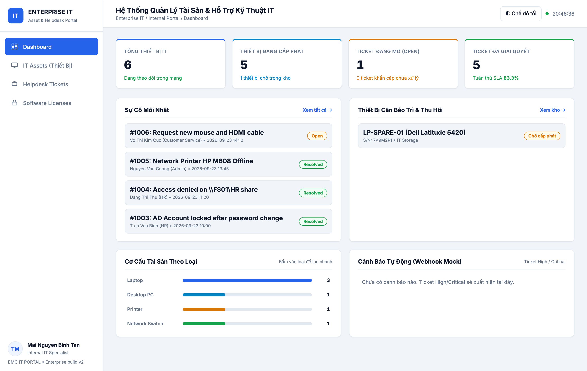
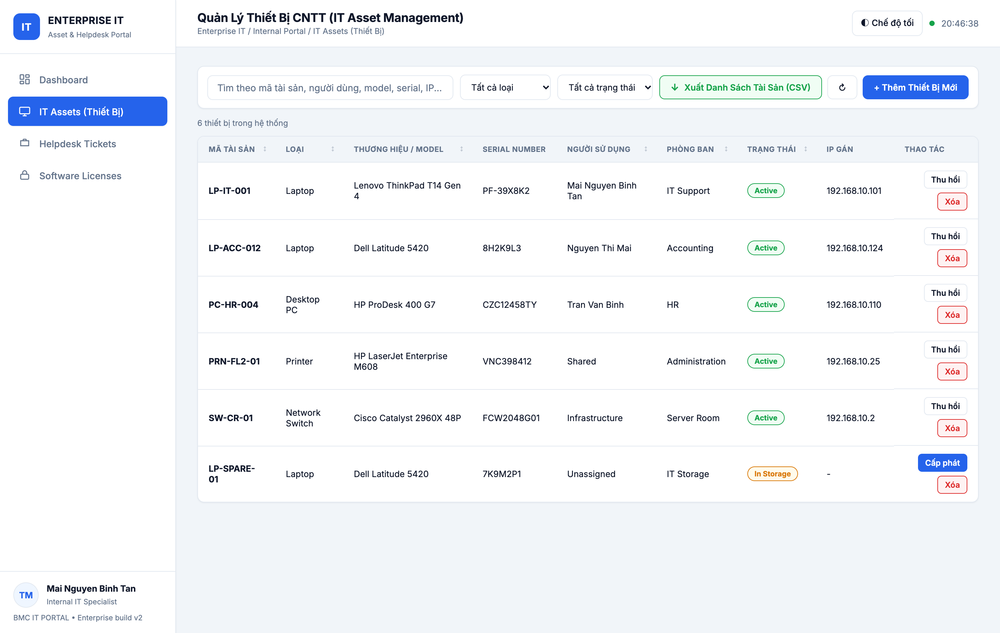
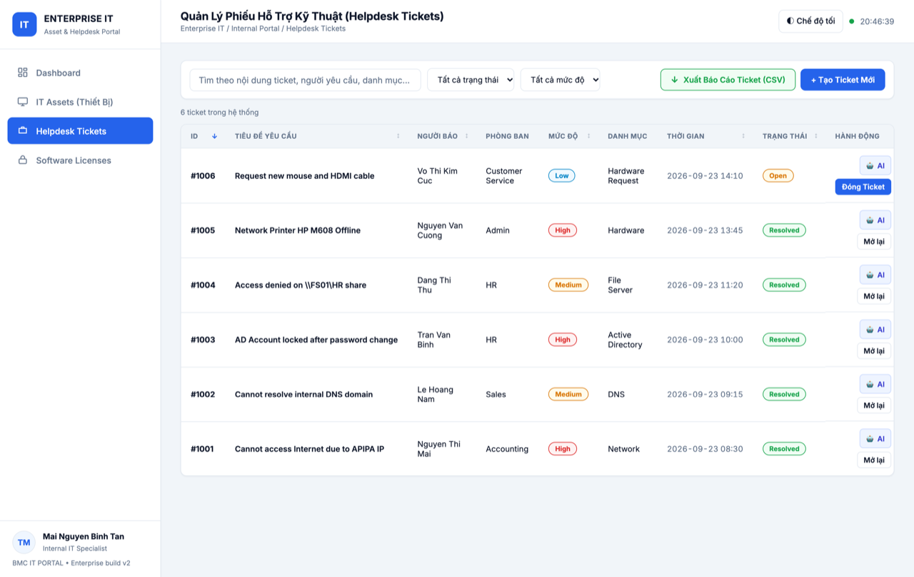

<div align="center">

# 🏢 Enterprise IT Helpdesk Lab

**Phòng Lab hạ tầng doanh nghiệp (Windows Server 2022) + Cổng IT Asset & Helpdesk nội bộ — Portfolio thực chiến cho vị trí IT Helpdesk / IT Support / Internal IT / Junior System Administrator**

[](https://github.com/imtarget05/Enterprise-IT-Helpdesk-Lab/actions/workflows/ci.yml)
[](LICENSE)
[](internal-portal/package.json)
[](internal-portal/README.md)
[](internal-portal/docker-compose.yml)
[](docs/01-lab-topology-vmware.md)
[](tickets/)

</div>

> ### TL;DR (English)
> A hands-on **enterprise IT lab on Windows Server 2022** (AD DS, DNS, DHCP, GPO, File Server/NTFS, Shadow Copies) with **20 ITIL incident tickets** (each one documented as *symptom → diagnosis → root cause → resolution → prevention*), **3 production-grade PowerShell automation scripts** verified by the **real PowerShell AST parser**, and a **full-stack Internal IT Asset & Helpdesk Portal** — Node.js/Express REST API, atomic JSON persistence (no external DB), CSV audit export that opens cleanly in Excel (UTF-8 BOM), Docker multi-stage image running as non-root with healthcheck, and a test suite of **93 unit/integration tests + 61 curl API tests** that all run green in CI.
> Built to mirror the daily workload of an **IT Helpdesk / IT Support / Internal IT / Junior SysAdmin** role.

---

## 📑 Mục lục

- [⚡ Chạy nhanh (2 phút)](#chạy-nhanh-2-phút)
- [📸 Screenshots & Demo](#screenshots--demo)
- [🎯 Dự án này chứng minh được gì](#dự-án-này-chứng-minh-được-gì)
- [🧱 Tech stack](#tech-stack)
- [1. Mô hình hạ tầng phòng Lab](#1-mô-hình-hạ-tầng-phòng-lab)
- [2. 20 kịch bản sự cố thực chiến (ITIL)](#2-20-kịch-bản-sự-cố-thực-chiến-itil)
- [3. Công cụ tự động hóa PowerShell](#3-công-cụ-tự-động-hóa-powershell)
- [4. IT Asset & Helpdesk Portal](#4-it-asset--helpdesk-portal)
- [5. Kiểm thử tự động & CI](#5-kiểm-thử-tự-động--ci)
- [6. Cấu trúc repo](#6-cấu-trúc-repo)
- [7. Tài liệu chi tiết](#7-tài-liệu-chi-tiết)
- [8. Tác giả & Liên hệ](#8-tác-giả--liên-hệ)

---

## Chạy nhanh (2 phút)

### Cách 1 — Chạy Portal trực tiếp bằng Node.js (nhanh nhất)

```bash
git clone https://github.com/imtarget05/Enterprise-IT-Helpdesk-Lab.git
cd Enterprise-IT-Helpdesk-Lab/internal-portal
npm install
npm start        # → mở http://localhost:3000
```

### Cách 2 — Chạy bằng Docker (giống môi trường máy chủ)

```bash
cd internal-portal
docker compose up -d --wait     # build + chạy; dữ liệu mount vào ./data
open http://localhost:3000      # Linux: xdg-open
```

### Chạy toàn bộ kiểm thử (chứng minh chất lượng)

```bash
cd internal-portal
npm test                              # 93 unit + integration test (node:test)
./test-api.sh                         # 61 curl test phủ 100% REST endpoints
bash ../scripts/verify-ps1-syntax.sh  # parse 3 file .ps1 bằng AST parser thật
```

### Khôi phục dữ liệu demo về trạng thái chuẩn

```bash
cd internal-portal
cp fixtures/db.baseline.json data/db.json
```

---

## Screenshots & Demo

> Ảnh minh chứng hệ thống **chạy thật** (không chỉ là tài liệu mô tả). Danh sách đầy đủ
> và hướng dẫn chụp/che thông tin nhạy cảm: [`docs/images/README.md`](docs/images/README.md).

| Khu vực | Nội dung thể hiện | Trạng thái |
|---|---|---|
| Portal — Dashboard | 4 thẻ KPI (tổng thiết bị, đang cấp phát, ticket mở, ticket đã xử lý + % SLA), bảng sự cố mới nhất, hàng đợi cảnh báo | 📷 `docs/images/portal-dashboard.png` |
| Portal — IT Assets | Bảng thiết bị, bộ lọc trạng thái/loại, nút cấp phát – thu hồi, nút **Xuất CSV** | 📷 `docs/images/portal-assets.png` |
| Portal — Helpdesk Tickets | Danh sách ticket ITIL, form tạo ticket, đổi trạng thái Open → In Progress → Resolved | 📷 `docs/images/portal-tickets.png` |
| Portal — CSV trong Excel | File `IT-Asset-Audit_YYYYMMDD_HHmm.csv` mở bằng Excel, tiếng Việt không lỗi font | 📷 `docs/images/portal-csv-excel.png` |
| Portal — Docker | `docker compose ps` cột STATUS = **healthy** | 📷 `docs/images/portal-docker-healthy.png` |
| Lab — Active Directory | ADUC với cây OU `Company_Enterprise → Departments`, user/group mẫu | 📷 `docs/images/lab-aduc.png` |
| Lab — Group Policy | Group Policy Management: Password Policy, Mapped Drive, USB Block | 📷 `docs/images/lab-gpo.png` |
| Lab — DHCP/APIPA | `ipconfig /all` trước (169.254.x.x) và sau khi `ipconfig /renew` thành công | 📷 `docs/images/lab-apipa-before-after.png` |
| Lab — DNS | `nslookup` thất bại khi DNS sai → sửa DNS → `nslookup` thành công | 📷 `docs/images/lab-dns-nslookup.png` |

<!--
  HƯỚNG DẪN: sau khi bạn đặt ảnh vào docs/images/, hãy xoá cặp thẻ comment HTML đang bọc
  danh sách bên dưới (thẻ mở ở dòng này và thẻ đóng ở cuối danh sách) thì ảnh sẽ hiển thị
  trực tiếp trong README. Khi chưa có ảnh, README vẫn render sạch, không có link gãy.






-->

---

## Dự án này chứng minh được gì

| Kỹ năng nhà tuyển dụng tìm | Bằng chứng cụ thể trong repo |
|---|---|
| **Active Directory / Identity** | Tạo – khoá – mở khoá – reset mật khẩu – phân nhóm theo OU, join domain ([`docs/02-ad-dns-dhcp-setup.md`](docs/02-ad-dns-dhcp-setup.md), ticket [INC-1003](tickets/ticket-003-account-locked-password-reset.md)) |
| **DNS / DHCP** | Forward lookup zone, DHCP scope + reservation, chẩn đoán APIPA & DNS loopback ([INC-1001](tickets/ticket-001-cannot-access-internet.md), [INC-1002](tickets/ticket-002-cannot-resolve-dns.md), [INC-1006](tickets/ticket-006-dhcp-ip-conflict-apipa.md)) |
| **Group Policy** | Ma trận GPO kèm mục đích nghiệp vụ – phạm vi – hiệu ứng – cách rollback ([`docs/03-gpo-security-matrix.md`](docs/03-gpo-security-matrix.md)) |
| **File Server & NTFS** | Share vs NTFS permission, group-based access theo least privilege, xử lý xung đột Read/Modify ([INC-1004](tickets/ticket-004-cannot-access-network-share.md), [INC-1018](tickets/ticket-018-shared-folder-ntfs-vs-share-perms.md)) |
| **Endpoint / User lifecycle** | Quy trình onboarding & offboarding có checklist ([`docs/05-onboarding-offboarding-sop.md`](docs/05-onboarding-offboarding-sop.md), [REQ-2014](tickets/ticket-014-new-laptop-onboarding-provision.md), [REQ-2015](tickets/ticket-015-employee-termination-offboarding.md)) |
| **Backup / Restore** | VSS Shadow Copy recovery + drill phục hồi dữ liệu thật ([INC-1012](tickets/ticket-012-accidental-file-deletion-shadow-copy.md), [INC-1020](tickets/ticket-020-backup-failure-and-recovery-test.md)) |
| **Troubleshooting có kỷ luật** | 20 ticket theo khung ITIL: symptom → diagnosis → RCA → resolution → prevention, kèm command/log thật |
| **PowerShell automation** | 3 script AD/asset/network + linter tĩnh + **AST parser PowerShell thật** trong CI ([`scripts/`](scripts/)) |
| **Lập trình phần mềm nội bộ** | Portal Node.js/Express: REST API đầy đủ, validation 400/404/409/422, 405 + header `Allow`, error handler tập trung ([`internal-portal/src/app.js`](internal-portal/src/app.js)) |
| **Dữ liệu & bền vững** | JSON store ghi **atomic (tmp → rename)**, corrupt-safe (đổi tên file hỏng rồi seed lại), graceful shutdown ([`internal-portal/src/store.js`](internal-portal/src/store.js)) |
| **Report cho phòng ban khác** | Xuất CSV RFC-4180 + UTF-8 BOM để Kế toán/Tài sản mở bằng Excel không lỗi font ([`internal-portal/src/csv.js`](internal-portal/src/csv.js)) |
| **Kiểm thử & CI** | 93 unit/integration test + 61 curl test + GitHub Actions (Node 18/20/22, AST PowerShell, compose config) |
| **Bảo mật vận hành** | Container non-root, `read_only`, `cap_drop: ALL`, `no-new-privileges`, log rotation, healthcheck |

---

## Tech stack

| Lớp | Công nghệ sử dụng |
|---|---|
| Hạ tầng lab | VMware / VirtualBox · Windows Server 2022 Datacenter (AD DS, DNS, DHCP, GPO, File Server) · Windows 11 Pro |
| Tự động hóa | PowerShell 5.1 / 7.x (ActiveDirectory, CIM/WMI, NetTCPIP module) |
| Backend | Node.js 18/20/22 · Express 4 · CORS · `node:test` (không framework ngoài) |
| Frontend | HTML5 · CSS3 (dark mode, responsive) · Vanilla JavaScript (không build step) |
| Lưu trữ | JSON file store tự viết: atomic write, corrupt-safe, promise-chain serialize |
| Đóng gói | Docker multi-stage (node:20-alpine, non-root) · Docker Compose v2 |
| CI/CD | GitHub Actions: matrix Node, AST PowerShell parse, compose validation |
| Tài liệu | Markdown chuẩn ITIL, sơ đồ ASCII, ma trận troubleshooting |

---

## 1. Mô hình hạ tầng phòng Lab

```text
                           [INTERNET / WAN]
                                  │
                                  ▼
               +---------------------------------------+
               |     Virtual Router / Host Gateway     |
               |         (Subnet: 192.168.10.0/24)     |
               +---------------------------------------+
                                  │
         ┌────────────────────────┼────────────────────────┐
         │                        │                        │
         ▼                        ▼                        ▼
+-----------------+      +-----------------+      +-----------------+
|   DC01-SERVER   |      |   FS01-SERVER   |      |   CL01-WIN11    |
| Windows Server  |      | Windows Server  |      | Windows 11 Pro  |
| 2022 Datacenter |      | 2022 Datacenter |      | Enterprise      |
| IP: 192.168.10.10|     | IP: 192.168.10.15|     | IP: DHCP Lease  |
|                 |      |                 |      |                 |
| Roles & Services|      | Roles & Services|      | User Client     |
| - AD DS (DC)    |      | - File Server   |      | - Domain Joined |
| - DNS Server    |      | - Shadow Copies |      | - Mapped Drives |
| - DHCP Server   |      | - Print Server  |      | - Outlook M365  |
| - GPO Manager   |      | - NTFS Shares   |      | - Endpoint EDR  |
+-----------------+      +-----------------+      +-----------------+
```

Chi tiết IP scheme, cấu hình VM (RAM/CPU/disk), thứ tự snapshot: [`docs/01-lab-topology-vmware.md`](docs/01-lab-topology-vmware.md)


---

## 2. 20 kịch bản sự cố thực chiến (ITIL)

Toàn bộ 20 ticket được biên soạn theo chuẩn ITIL — mỗi file gồm 5 phần cố định:
**Mô tả sự cố → Chẩn đoán (kèm command/log) → Nguyên nhân gốc rễ (RCA) → Các bước khắc phục → Nghiệm thu & Phòng ngừa**. Xem thư mục [`tickets/`](tickets/).

| Ticket ID | Tiêu đề sự cố | Phân loại | Mức độ | Kỹ năng kỹ thuật chứng minh |
|---|---|---|---|---|
| [INC-1001](tickets/ticket-001-cannot-access-internet.md) | Cannot Access Internet (APIPA IP 169.254.x.x) | Network | High | Khắc phục lỗi DHCP Client, reset TCP/IP stack, renew IP. |
| [INC-1002](tickets/ticket-002-cannot-resolve-dns.md) | Cannot Resolve DNS (Localhost Loopback) | DNS | Medium | Chẩn đoán nslookup, khôi phục DNS DHCP, flushdns. |
| [INC-1003](tickets/ticket-003-account-locked-password-reset.md) | Account Locked Out & Credential Sync | Active Directory | High | Tra cứu Event Viewer ID 4740, mở khóa tài khoản, xử lý Wi-Fi mobile. |
| [INC-1004](tickets/ticket-004-cannot-access-network-share.md) | Access Denied on Shared Folder `\\FS01\HR` | File Server | Medium | Phân quyền Security Groups, cơ chế cập nhật vé Kerberos TGT. |
| [INC-1005](tickets/ticket-005-network-printer-offline.md) | Network Printer Offline after Power Outage | Printing | High | Xử lý kẹt IP máy in, tạo DHCP Reservation theo MAC, Print Spooler. |
| [INC-1006](tickets/ticket-006-dhcp-ip-conflict-apipa.md) | DHCP IP Conflict & Scope Exhaustion | Network | High | Bắt gói ARP, xử lý IP tĩnh đè động, mở rộng Scope DHCP. |
| [INC-1007](tickets/ticket-007-wifi-dropping-connection.md) | Wi-Fi Dropping & Roaming Disconnects | Wireless | Medium | Tối ưu Roaming Aggressiveness, ưu tiên băng tần 5GHz AX. |
| [INC-1008](tickets/ticket-008-outlook-cannot-connect-exchange.md) | Outlook Disconnected & Credential Cache Loop | M365 / Mail | High | Dọn dẹp Windows Credential Manager, reset Modern Auth Token. |
| [INC-1009](tickets/ticket-009-bsod-system-crash-analysis.md) | BSOD MEMORY_MANAGEMENT (0x1A) | Hardware | High | Đọc file Minidump bằng BlueScreenView, chạy MemTest86 thay RAM. |
| [INC-1010](tickets/ticket-010-disk-full-c-drive-cleanup.md) | Low Disk Space on Drive C: (450MB left) | Storage | Medium | Dọn SoftwareDistribution, VSSAdmin shadowstorage, hiberfil.sys. |
| [INC-1011](tickets/ticket-011-malware-quarantine-incident.md) | Trojan Dropper Malware Quarantine | Security | Critical | Cô lập mạng vật lý, ngắt cổng switch, dọn Registry run keys. |
| [INC-1012](tickets/ticket-012-accidental-file-deletion-shadow-copy.md) | Shift+Delete File Recovery via Shadow Copies | Data Recovery | High | Khôi phục file thuế kế toán qua Volume Shadow Copies (VSS). |
| [INC-1013](tickets/ticket-013-vpn-connection-failure.md) | Remote Access VPN Blocked at Hotel Wi-Fi | Network / VPN | High | Chẩn đoán Test-NetConnection, mở cổng dự phòng TCP 443. |
| [REQ-2014](tickets/ticket-014-new-laptop-onboarding-provision.md) | New Laptop Provisioning & Onboarding | Onboarding | Medium | Script tạo AD User, gán license M365, dán Asset Tag, bàn giao. |
| [REQ-2015](tickets/ticket-015-employee-termination-offboarding.md) | Employee Termination & IT Offboarding | Security | High | Khóa tài khoản tức thời, chuyển Shared Mailbox, thu hồi laptop. |
| [INC-1016](tickets/ticket-016-usb-storage-blocked-by-gpo.md) | USB Storage Blocked by Group Policy | Security GPO | Medium | Cấu hình ngoại lệ GPO Security Filtering cho phòng Marketing. |
| [INC-1017](tickets/ticket-017-slow-pc-performance-troubleshooting.md) | Slow PC Performance & Thermal Throttling | Hardware | Low | Tra keo tản nhiệt, vệ sinh quạt, khắc phục xung nhịp 0.79GHz. |
| [INC-1018](tickets/ticket-018-shared-folder-ntfs-vs-share-perms.md) | Shared Folder Read-Only Permissions Conflict | File Server | Medium | Khắc phục xung đột Share Permissions (Read) vs NTFS (Modify). |
| [INC-1019](tickets/ticket-019-voip-ip-phone-registration-failure.md) | VoIP IP Phone SIP Registration Failed | Telephony | High | Cấu hình Voice VLAN 20 trên Switch Cisco, mở cổng SIP UDP 5060. |
| [INC-1020](tickets/ticket-020-backup-failure-and-recovery-test.md) | Nightly Backup Failure & Recovery Drill | Backup / DR | Critical | Reset VSS Writers treo, dọn dẹp kho lưu trữ NAS, diễn tập restore. |

---

## 3. Công cụ tự động hóa PowerShell

| Script | Chức năng | Điểm đáng chú ý |
|---|---|---|
| [`scripts/New-CompanyUser.ps1`](scripts/New-CompanyUser.ps1) | Đọc CSV danh sách nhân viên mới → tạo tài khoản AD, đặt đúng OU phòng ban, gán mật khẩu ngẫu nhiên, thêm Security Group | Có `-WhatIf`-style dry-run, log kết quả từng dòng |
| [`scripts/Export-ITAssetAudit.ps1`](scripts/Export-ITAssetAudit.ps1) | Truy vấn CIM/WMI lấy CPU, RAM, ổ đĩa, MAC, serial BIOS → xuất JSON kiểm kê tài sản | Kết quả JSON khớp định dạng dữ liệu của Portal |
| [`scripts/Test-NetworkHealth.ps1`](scripts/Test-NetworkHealth.ps1) | 9 bước kiểm tra: Loopback → Gateway → DNS nội bộ → cổng Kerberos/LDAP của DC → Internet | In bảng PASS/FAIL, dùng được cho checklist sự cố mạng |
| [`scripts/verify-ps1-syntax.sh`](scripts/verify-ps1-syntax.sh) | Parse 3 script trên bằng **AST parser chính thức** (`Language.Parser::ParseFile`) qua `pwsh` local hoặc container PowerShell | Chạy được trên macOS/Linux không có PowerShell; tự fallback sang Docker |

> **Lỗi thật đã tìm và sửa nhờ bộ kiểm thử này:** `New-CompanyUser.ps1` từng viết `"$username:"` — PowerShell hiểu `$username:` là *scope/drive reference* nên báo `Variable reference is not valid`. Đã sửa thành `"${username}:"`; regression test giữ cố định trong [`internal-portal/test/ps1-syntax.test.js`](internal-portal/test/ps1-syntax.test.js).


---

## 4. IT Asset & Helpdesk Portal

Ứng dụng web nội bộ hoàn chỉnh tại [`internal-portal/`](internal-portal/) — chi tiết kiến trúc & API: [`internal-portal/README.md`](internal-portal/README.md).

**Công nghệ:** Node.js + Express 4 (REST API), HTML5/CSS3 responsive, Vanilla JavaScript (không build step).
Persistence file JSON nguyên tử — **không cần database ngoài, 0 dependency native**.

| Tính năng | Mô tả |
|---|---|
| **Dashboard** | KPI tài sản theo trạng thái, ticket mở/đã xử lý, tỷ lệ SLA, cơ cấu theo loại thiết bị, hàng đợi cảnh báo |
| **Quản lý thiết bị** | Đăng ký Laptop/PC/Máy in/Switch; Asset Tag & Serial **duy nhất** (trùng → HTTP 409); cấp phát / thu hồi; tìm kiếm – lọc – sắp xếp |
| **Xuất báo cáo kiểm kê** | File `IT-Asset-Audit_YYYYMMDD_HHmm.csv` chuẩn RFC-4180 + **UTF-8 BOM** (Excel mở không lỗi font tiếng Việt), tôn trọng bộ lọc đang chọn |
| **Quản lý ticket ITIL** | Tiếp nhận – phân loại – đổi trạng thái Open → In Progress → Resolved/Closed (tự ghi `resolvedAt`); ticket **High/Critical tự động bắn cảnh báo** (mock console + `data/notifications.log`, cấu hình `IT_WEBHOOK_URL` để nối Slack/Teams thật) |
| **Bản quyền phần mềm** | Theo dõi tổng/đã gán/còn trống, `utilizationPercent`, cảnh báo sắp hết chỗ cấp phát |
| **Dữ liệu bền vững** | Mọi mutation ghi xuống `data/db.json` theo cơ chế **atomic (tmp → rename)**; file JSON hỏng được đổi tên `.corrupt-<timestamp>` rồi seed lại (server không bao giờ chết vì dữ liệu); `SIGTERM/SIGINT` → flush rồi đóng server |

### REST API (rút gọn)

| Method | Endpoint | Mô tả |
|---|---|---|
| GET | `/api/health` | Trạng thái, version, storage, số bản ghi |
| GET | `/api/dashboard/stats` | KPI dashboard + cảnh báo license |
| GET · POST | `/api/assets` | Danh sách (filter `q/status/type`) · đăng ký thiết bị mới |
| GET · PATCH · DELETE | `/api/assets/:id` | Chi tiết · cập nhật · xóa |
| GET | `/api/assets/export.csv` | Tải file kiểm kê CSV (theo filter) |
| GET · POST | `/api/tickets` | Danh sách (filter `q/status/priority`) · tạo ticket (+ webhook nếu High/Critical) |
| GET | `/api/tickets/:id` · `/api/tickets/export.csv` | Chi tiết · báo cáo CSV |
| PATCH | `/api/tickets/:id/status` | Chuyển trạng thái ticket |
| GET | `/api/licenses` · `/api/licenses/:id` | Bản quyền + `utilizationPercent` |
| GET | `/api/notifications` | Lịch sử cảnh báo đã gửi (`?limit=`) |

**Tài liệu API đầy đủ dạng OpenAPI 3.1:** [`internal-portal/public/openapi.yaml`](internal-portal/public/openapi.yaml) — server phục vụ tĩnh tại `/openapi.yaml`, dán vào [Swagger Editor](https://editor.swagger.io) để xem dạng tương tác. Spec được **validate tự động trong CI** (job `openapi-spec`) nên luôn đúng chuẩn.

Mã lỗi theo hợp đồng rõ ràng: **400** thiếu/sai dữ liệu · **404** không tồn tại · **405** + header `Allow` khi sai method · **409** trùng Asset Tag/Serial · **422** giá trị enum sai.

### Chạy & đóng gói

```bash
cd internal-portal
npm install && npm start                  # dev nhanh → http://localhost:3000
npm run dev                               # node --watch, tự reload

docker compose up -d --wait               # bản production: non-root, read_only, healthcheck
docker compose logs -f it-portal          # xem log + cảnh báo ticket High/Critical
docker compose restart                    # kiểm chứng persistence: dữ liệu vẫn còn
```

Biến môi trường (xem [`internal-portal/.env.example`](internal-portal/.env.example)):
`PORT` (3000) · `HOST` (0.0.0.0) · `DATA_DIR` (./data) · `IT_WEBHOOK_URL` (tuỳ chọn) · `ALLOWED_ORIGINS` (*).

---

## 5. Kiểm thử tự động & CI

| Lệnh | Nội dung | Kết quả |
|---|---|---|
| `npm test` (trong `internal-portal/`) | 93 test `node:test`: store atomic/corrupt-safe, CSV escaping + BOM, notifier, integration HTTP thật trên ephemeral port, persistence qua restart, UI contract, linter + mutation test PowerShell | **93/93 PASS** |
| `./test-api.sh` | Smoke test **curl** phủ **100% REST endpoints**, tự boot server ở port riêng với data tạm, in bảng PASS/FAIL, exit code 0/1 | **61/61 PASS (100%)** |
| `bash scripts/verify-ps1-syntax.sh` | Parse 3 file `.ps1` bằng **AST parser PowerShell thật** | **3/3 file sạch** |
| `bash scripts/verify-config.sh` | Validate compose + kiểm tra interpolation biến, healthcheck, `cap_drop`, `read_only`, log rotation, restart policy | **Toàn bộ ✅** |

**GitHub Actions** ([`.github/workflows/ci.yml`](.github/workflows/ci.yml)) chạy trên mỗi push/PR vào `main`, gồm 3 job song song:

1. `portal-tests` — ma trận **Node 18 / 20 / 22**: `npm ci` → `npm test` → `./test-api.sh`
2. `ps1-syntax` — parse AST 3 script PowerShell (không cần Windows)
3. `compose-config` — `docker compose config --quiet` + đối chiếu biến với `.env.example`

> Badge CI ở đầu README phản ánh trạng thái thật của lần chạy mới nhất trên `main`.


---

## 6. Cấu trúc repo

```text
05-Enterprise-IT-Helpdesk-Lab/
├── README.md                     ← bạn đang ở đây
├── LICENSE                       ← MIT
├── .github/workflows/ci.yml      ← CI: tests + AST PowerShell + compose validation
│
├── docs/                         ← tài liệu hạ tầng & quy trình
│   ├── 01-lab-topology-vmware.md      Topology, IP scheme, cấu hình VM, snapshot
│   ├── 02-ad-dns-dhcp-setup.md        Cài DC, DNS, DHCP, join domain
│   ├── 03-gpo-security-matrix.md      Ma trận GPO: mục đích – phạm vi – rollback
│   ├── 04-troubleshooting-matrix.md   Ma trận triệu chứng → nguyên nhân → cách xử lý
│   ├── 05-onboarding-offboarding-sop.md  SOP bàn giao & thu hồi thiết bị
│   ├── 06-interview-qa.md             30 câu hỏi phỏng vấn IT Helpdesk kèm đáp án
│   ├── images/                        Ảnh minh chứng (xem docs/images/README.md)
│   └── internal/                      SPEC & kế hoạch triển khai nội bộ
│
├── tickets/                      ← 20 ticket ITIL (INC-1001..INC-1020, REQ-2014/2015)
├── scripts/                      ← PowerShell automation + script verify
│
└── internal-portal/              ← ứng dụng nội bộ (Node.js/Express + SPA)
    ├── server.js                      bootstrap: createApp + listen + graceful shutdown
    ├── src/app.js                     routes + validation + error handler (factory thuần)
    ├── src/store.js                   JSON store atomic, corrupt-safe, nextId/find
    ├── src/seed.js                    dữ liệu mẫu doanh nghiệp (assets/tickets/licenses)
    ├── src/csv.js                     toCsv() RFC-4180 + UTF-8 BOM + auditFilename()
    ├── src/notify.js                  webhook mock cho ticket High/Critical
    ├── public/                        index.html · app.js · styles.css (SPA, no build)
    ├── test/                          12 test suite (node:test) + helpers + ps1-lint
    ├── test-api.sh                    smoke test curl 100% endpoints
    ├── fixtures/db.baseline.json      snapshot dữ liệu demo để restore nhanh
    ├── Dockerfile · docker-compose.yml · .env.example
    └── README.md                      kiến trúc chi tiết + API + persistence
```

---

## 7. Tài liệu chi tiết

| Tài liệu | Nội dung |
|---|---|
| [`docs/01-lab-topology-vmware.md`](docs/01-lab-topology-vmware.md) | Thiết kế phòng lab: subnet, IP tĩnh/động, tài nguyên VM, quy trình snapshot |
| [`docs/02-ad-dns-dhcp-setup.md`](docs/02-ad-dns-dhcp-setup.md) | Dựng Domain Controller, DNS zone, DHCP scope, join máy trạm vào domain |
| [`docs/03-gpo-security-matrix.md`](docs/03-gpo-security-matrix.md) | Ma trận GPO: mục đích nghiệp vụ, phạm vi áp dụng, hiệu ứng mong đợi, cách rollback |
| [`docs/04-troubleshooting-matrix.md`](docs/04-troubleshooting-matrix.md) | Bảng tra nhanh triệu chứng → khả năng nguyên nhân → bước kiểm tra |
| [`docs/05-onboarding-offboarding-sop.md`](docs/05-onboarding-offboarding-sop.md) | SOP chuẩn cho nhân viên mới & nhân viên nghỉ việc (checklist từng bước) |
| [`docs/06-interview-qa.md`](docs/06-interview-qa.md) | 30 câu hỏi phỏng vấn IT Helpdesk/IT Support kèm câu trả lời chi tiết |
| [`internal-portal/README.md`](internal-portal/README.md) | Kiến trúc portal, REST API, cơ chế persistence, Docker, bộ test |
| [`internal-portal/fixtures/README.md`](internal-portal/fixtures/README.md) | Cách khôi phục dữ liệu demo về trạng thái chuẩn |
| [`docs/images/README.md`](docs/images/README.md) | Danh mục ảnh cần chụp để chứng minh hệ thống chạy thật |
| [`docs/internal/`](docs/internal/) | SPEC dự án & kế hoạch hardening (tài liệu làm việc nội bộ) |

---

## 8. Tác giả & Liên hệ

**Mai Nguyen Binh Tan** — IT Support / Internal IT

- GitHub: [@imtarget05](https://github.com/imtarget05)
- Định hướng: IT Helpdesk → Internal IT → System Administrator / DevOps
- Nhận làm lab/demo theo yêu cầu: toàn bộ phòng lab có thể dựng lại theo tài liệu trong `docs/`

---

## License

Phát hành theo giấy phép [MIT](LICENSE) — dùng tự do cho mục đích học tập và tham khảo.

