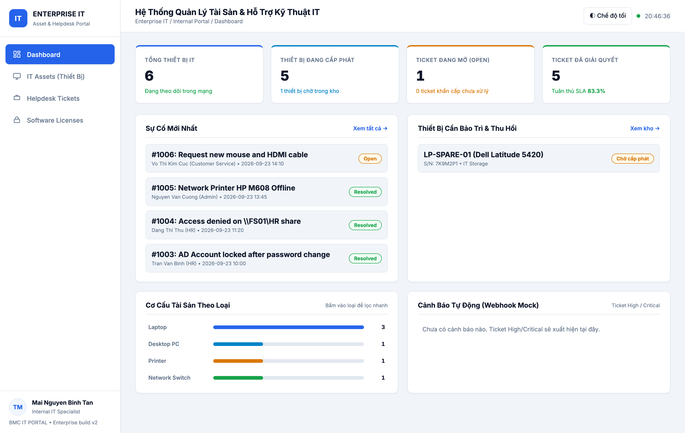
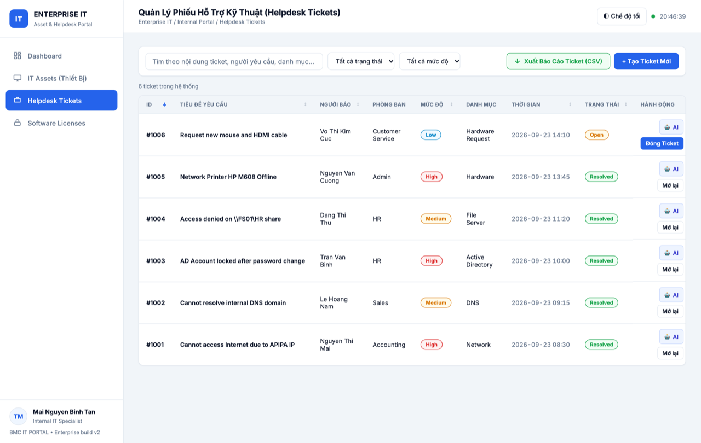
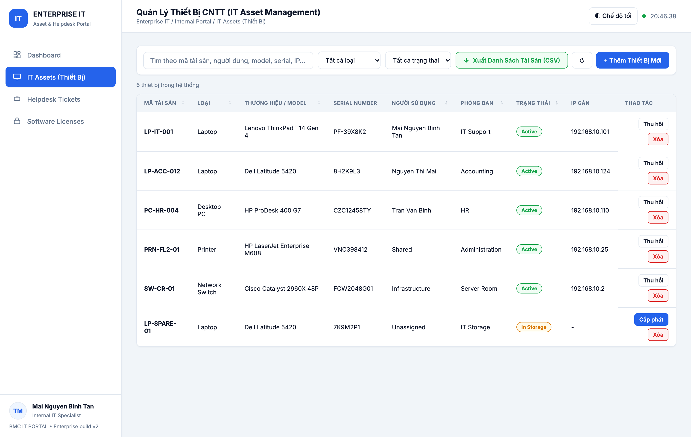
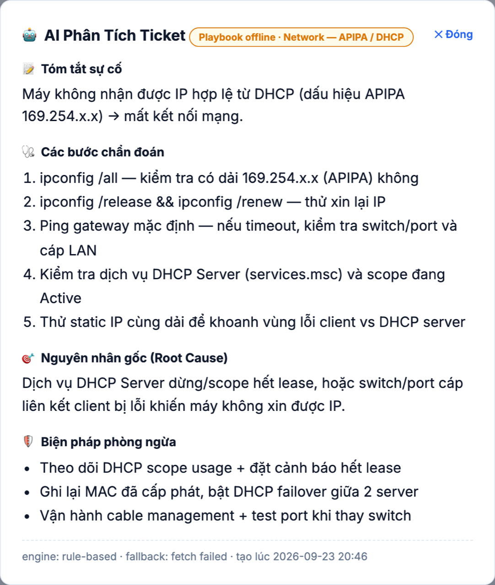

# 🖥️ Enterprise IT Operations Platform & Infrastructure Lab

> **Dự án portfolio end-to-end** mô phỏng môi trường IT doanh nghiệp (50–120 nhân viên),
> từ hạ tầng **Windows Server 2022, Active Directory, DNS, DHCP, GPO** đến **internal portal**, **PowerShell/Python automation** và **AI-assisted ITIL support**.
> `internal-portal/` là control-plane phần mềm trong cùng project, không phải một project tách rời.

<p align="center">
  <a href="https://github.com/imtarget05/Enterprise-IT-Helpdesk-Lab/actions/workflows/ci.yml">
    
  </a>
  
  
  
  
  
  
  
</p>

---

## 🔒 Ma trận GPO / Chính sách bảo mật

| Chính sách | Thiết lập đã triển khai |
|---|---|
| USB block | `GPO_Restrict_USB_Storage` — Deny all removable storage (OU Workstations, trừ IT) |
| Screen lock | `GPO_ScreenLock_Timeout` — khóa màn hình có mật khẩu sau 10 phút không thao tác |
| Share permissions | `FS01-SRV`: Share `Authenticated Users = Full Control/Change`; NTFS least-privilege theo `SG_HR_Users` / `SG_Accounting_Users` / `Public` Read & Write |
| Password policy | `GPO_DefaultDomainPasswordPolicy` — tối thiểu 10 ký tự + complexity, đổi mỗi 90 ngày, khóa sau 5 lần sai trong 15 phút |

Chi tiết đầy đủ: [docs/03-gpo-security-matrix.md](docs/03-gpo-security-matrix.md).

---

## Dự án này làm được gì?

Một bộ phận IT nhỏ (1–3 người) thường loay hoay với 3 bài toán:

1. **Không biết ai đang dùng máy nào** — tài sản IT quản lý bằng Excel, thường xuyên sai lệch.
2. **Xử lý sự cố mất thời gian** — mỗi lần gặp lỗi cũ phải chẩn đoán lại từ đầu vì không có tài liệu.
3. **Tạo tài khoản nhân viên mới mất 20 phút** — làm thủ công, dễ nhầm OU, thiếu group phân quyền.

Dự án này giải quyết cả 3:

- ✅ **Portal quản lý tài sản & ticket** — web app nội bộ để theo dõi máy tính, phiếu sự cố, bản quyền phần mềm.
- ✅ **20 kịch bản sự cố thực tế** — mỗi ticket có đầy đủ: triệu chứng → chẩn đoán → nguyên nhân → cách sửa → cách phòng tránh.
- ✅ **PowerShell tự động hóa** — tạo hàng loạt user AD từ file CSV, kiểm kê phần cứng, chẩn đoán mạng.

---

## Tôi đã xây dựng những gì?

### 🏗️ 1. Lab Windows Server 2022 (VMware)

Môi trường lab mô phỏng hệ thống IT thực tế tại văn phòng doanh nghiệp:

| Thành phần | Mô tả |
|---|---|
| 🏢 **Active Directory** | Domain `COMPANY.LOCAL`, cấu trúc OU theo phòng ban, tài khoản user/group |
| 🌐 **DNS & DHCP** | Phân giải tên nội bộ, cấp IP tự động, xử lý sự cố APIPA |
| 🔒 **Group Policy (GPO)** | Chính sách bảo mật: chặn USB, bắt buộc đổi mật khẩu, map ổ đĩa mạng |
| 📁 **File Server** | Phân quyền NTFS + Share Permission, Shadow Copy để khôi phục file bị xóa |

### 🌐 2. Portal nội bộ IT (Node.js web app)

Web app chạy trong Docker, dành cho nhân viên IT dùng hàng ngày:

| Tính năng | Mô tả |
|---|---|
| 💻 **Quản lý tài sản** | Danh sách máy tính, trạng thái (đang dùng / kho / bảo trì / thanh lý), xuất Excel/CSV |
| 🎫 **Quản lý ticket** | Tạo, theo dõi, đóng phiếu sự cố theo quy trình ITIL |
| 🚨 **Cảnh báo tự động** | Ticket ưu tiên Cao/Khẩn → nhận thông báo tức thì, ghi audit log |
| 📊 **Dashboard** | Tổng quan: số thiết bị, số ticket đang mở, tỉ lệ giải quyết đúng hạn |
| 🤖 **Trợ lý AI** | OpenAI (tuỳ chọn) → Ollama local → offline ITIL playbook fallback; gợi ý chẩn đoán và RCA |
| 🏭 **Factory Operations** | Monitoring, Problem/Change, Access lifecycle, audit và 12 scenario vận hành tái lập được |

### 📋 3. 20 kịch bản sự cố thực chiến

Mỗi ticket trong `tickets/` viết theo khung chuẩn ITIL:

> **Triệu chứng** → **Chẩn đoán từng bước** → **Nguyên nhân gốc rễ** → **Cách sửa** → **Cách phòng tránh**

| # | Sự cố | Nội dung |
|---|---|---|
| 001 | 🌐 Không vào được internet | APIPA, DHCP, gateway, DNS — chẩn đoán theo 6 lớp |
| 003 | 🔐 Tài khoản AD bị khóa | Unlock, đặt lại mật khẩu, tìm nguyên nhân lockout |
| 011 | 🦠 Máy tính nhiễm malware | Cô lập máy, quét, vá lỗ hổng, báo cáo sự cố |
| 012 | 🗂️ Xóa nhầm file quan trọng | Khôi phục từ Shadow Copy của Windows Server |
| 015 | 👋 Nhân viên nghỉ việc | Offboarding: vô hiệu AD, thu hồi tài sản, thu hồi bản quyền |
| 018 | 📁 Không vào được shared folder | Phân biệt NTFS Permission vs Share Permission |

### ⚡ 4. Tự động hóa PowerShell

| Script | Làm gì |
|---|---|
| `New-CompanyUser.ps1` | Đọc file CSV → tạo hàng loạt user AD, đặt vào đúng OU, gán group phòng ban |
| `Export-ITAssetAudit.ps1` | Quét thông tin phần cứng (CPU, RAM, ổ đĩa) → xuất file kiểm kê |
| `Test-NetworkHealth.ps1` | Chẩn đoán mạng 6 lớp: loopback → gateway → domain → DNS → internet |
| `Backup-HelpdeskData.ps1` / `Restore-HelpdeskData.ps1` | Backup JSON Portal có SHA-256, retention và restore an toàn vào test path |
| `Backup-ADConfiguration.ps1` | Export GPO, DHCP và DNS evidence trước thay đổi |
| `Disable-CompanyUser.ps1` | Offboarding idempotent: disable account, gỡ group nhạy cảm, ghi evidence |
| `Test-PrintScanHealth.ps1` | Kiểm tra print server, label printer, scanner USB wedge và MiniERP |

---

## Screenshots


*Dashboard: tổng quan tài sản, ticket đang xử lý, cảnh báo*


*Helpdesk Tickets: danh sách phiếu sự cố + nút phân tích AI*


*IT Assets: quản lý thiết bị, lọc trạng thái, xuất CSV*


*AI gợi ý chẩn đoán sự cố (offline playbook, không cần internet)*

---

## Tại sao làm dự án này?

Dự án nhắm vào nghiệp vụ **IT Helpdesk / Internal IT Support** tại doanh nghiệp vừa và nhỏ — đặc biệt là môi trường dùng Windows Server và Active Directory. Cách em làm là **ứng dụng nội bộ có AI hỗ trợ** (hướng ứng tuyển: **AI Application Engineer**), không phải quản trị hệ thống thuần; hạ tầng Windows/AD ở đây là bối cảnh vận hành mà ứng dụng phải phục vụ.

Công việc Helpdesk hàng ngày bao gồm:
- 🛠️ Tiếp nhận và xử lý sự cố người dùng (mạng, máy tính, email, tài khoản)
- 📦 Quản lý thiết bị IT, cấp phát và thu hồi khi có người vào/ra
- 👤 Tạo tài khoản, phân quyền cho nhân viên mới

Tôi đã thực hành đúng các kịch bản đó và ghi lại thành tài liệu để có thể giải thích rõ ràng trong buổi phỏng vấn.

---

## Chạy thử ngay (dưới 2 phút)

**Yêu cầu:** Node.js 20+ hoặc Docker.

```bash
# Option 1: Docker (khuyến nghị)
cd internal-portal
docker compose up -d --wait
# → Mở http://localhost:3000
# Image dùng root context để bundle runbooks/scenarios vào portal.
```

```bash
# Option 2: Node.js
git clone https://github.com/imtarget05/Enterprise-IT-Helpdesk-Lab.git
cd Enterprise-IT-Helpdesk-Lab/internal-portal
npm install && npm start
# → Mở http://localhost:3000
```

**Chạy test:**
```bash
cd internal-portal
npm test          # 337 test cases — 336 pass, 1 skipped ✅
./test-api.sh     # 68 curl API smoke checks — tất cả pass ✅
# 85 test của cổng Flask (python-portal + isolation), chạy trên DATA_FILE tạm nên không chạm data/db.json của Node
( cd python-portal && DATA_FILE="$(mktemp -d)/db.json" PORT=0 \
    python3 -m unittest discover -s . -p 'test_*.py' )
```

### Verified results

Measured at commit `c6671ce`. These are three separate suites, not one total.

| Suite | Command | Result |
|---|---|---|
| Node portal | `cd internal-portal && npm test` | **336 passed, 1 skipped** (337 cases) |
| API smoke | `cd internal-portal && ./test-api.sh` | **68/68 passed** |
| Python services | `.venv-helpdesk/bin/python -m pytest internal-portal/python-portal/tests/ internal-portal/python-portal/test_isolation.py llm-gateway/tests/ -q` | **156 passed, 4 xfailed** |

The 4 `xfailed` are mutation tests (M1–M4) that prove the safety tests have
teeth: each one re-introduces a real defect — demoting a HIGH_RISK action to
READ_ONLY, allowing an unknown action, widening RBAC so a VIEWER can execute,
accepting a raw PowerShell path — and the suite must catch it.

---

## Demo nhanh (cho buổi phỏng vấn)

**Demo 1 — Ticket khẩn cấp gửi cảnh báo tự động:**
```
Vào tab Tickets → tạo ticket mới với priority = "High"
→ Hệ thống tự ghi vào audit log, hiển thị trong Notifications
```

**Demo 2 — Xuất danh sách tài sản ra Excel:**
```
Vào tab IT Assets → lọc theo trạng thái → nhấn "Xuất Danh Sách (CSV)"
→ File CSV mở được trong Excel, tiếng Việt hiển thị đúng
```

**Demo 3 — Trợ lý AI gợi ý chẩn đoán sự cố:**
```
Vào tab Tickets → nhấn nút "AI" trên bất kỳ ticket nào
→ Hiển thị: tóm tắt sự cố, các bước chẩn đoán, nguyên nhân, cách phòng tránh
(Hoạt động cả khi không có OpenAI key hoặc Ollama — dùng playbook offline)
```

---

## Cấu trúc project

```
05-Enterprise-IT-Helpdesk-Lab/
├── 📁 tickets/              ← 20 kịch bản sự cố ITIL thực chiến
├── 📁 docs/                 ← topology, AD/DNS/DHCP, GPO, onboarding + 5 factory runbook
├── 📁 scenarios/factory/    ← 12 scenario tái lập được cho Factory IT
├── 📁 scripts/              ← PowerShell automation + CI/evidence helper
├── 📁 artifacts/            ← baseline và final verification evidence
└── 📁 internal-portal/      ← Module control plane: Node.js portal + AI/ticket/asset API (cùng project)
    ├── 📁 src/              ← API server (Express) + auth/ITSM/monitoring
    ├── 📁 public/           ← Giao diện web (HTML/JS/CSS)
    └── 📁 test/             ← 337 test cases (336 pass, 1 skipped) + 12 factory scenario contract
```

---

## Tech stack

<p>
  
  
  
  
  
  
  
  
</p>

---

## Tài liệu tham khảo

- [🗺️ Topology & cấu hình VM](docs/01-lab-topology-vmware.md)
- [🖥️ Cài đặt AD / DNS / DHCP](docs/02-ad-dns-dhcp-setup.md)
- [🔒 Ma trận GPO bảo mật](docs/03-gpo-security-matrix.md)
- [🎫 20 ticket sự cố](tickets/)
- [🏭 Factory operations & 12 scenario](scenarios/factory/)
- [🧭 VLAN / Firewall runbook](docs/07-vlan-firewall-design.md)
- [🧭 AD / Identity / Security runbook](docs/08-ad-identity-security.md)
- [🧭 Monitoring / Incident runbook](docs/09-monitoring-incident-runbook.md)
- [🧭 Backup / Restore / DR runbook](docs/10-backup-restore-dr.md)
- [🧭 MiniERP integration contract](docs/11-minierp-integration.md)
- [❓ Câu hỏi phỏng vấn Helpdesk](docs/06-interview-qa.md)

---

**MIT License** — *Dự án portfolio của **Mai Nguyễn Bình Tân*** — GitHub: [@imtarget05](https://github.com/imtarget05)
