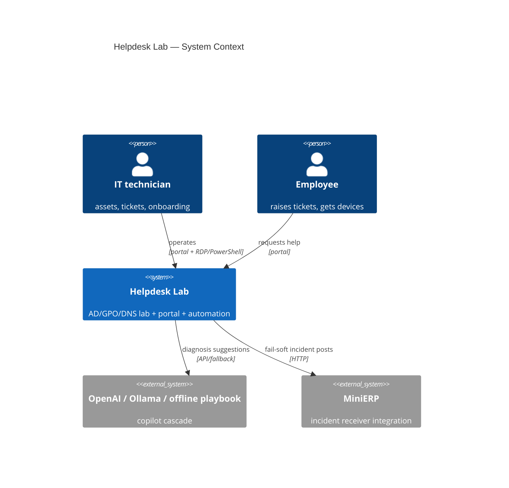
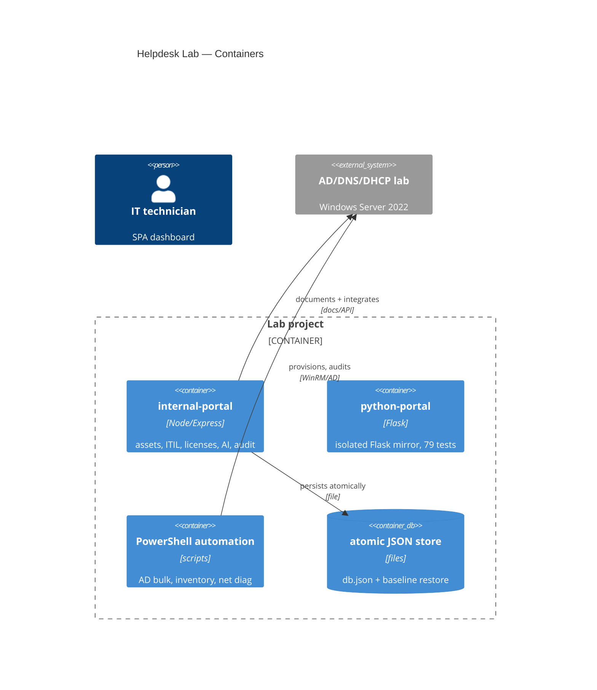

# Enterprise IT Helpdesk Lab — C4 Architecture

> Source of truth: repo README (lab + portal + 20 tickets + PowerShell) and
> `internal-portal/README.md`. Portal is the software control plane INSIDE the
> lab project, not a separate project.

## C4-Context

## C4-Container

