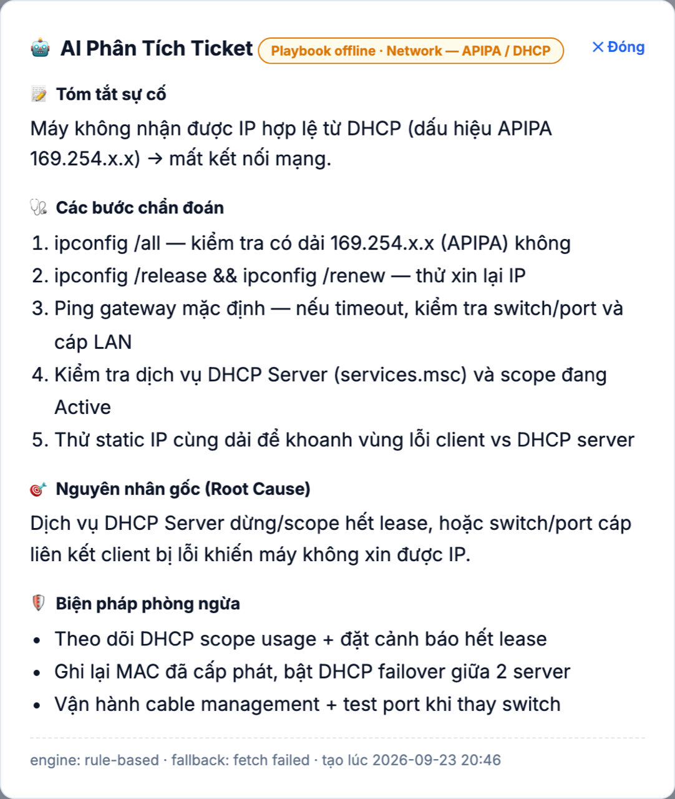
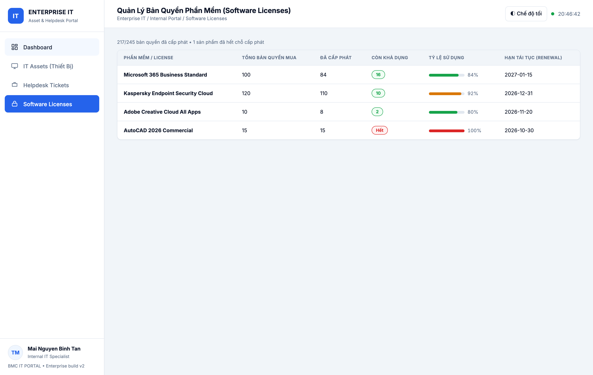
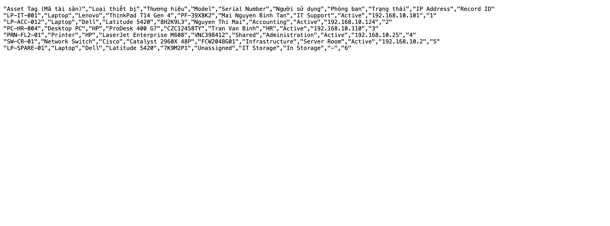

# IT Asset & Helpdesk Management Portal — v2.0.0

Ứng dụng web nội bộ quản lý **tài sản CNTT**, **ticket hỗ trợ (ITIL)** và **bản quyền phần mềm**, xây theo JD *Nhân viên IT (phần mềm nội bộ + IT Support)* — BMC Việt Nam / *IT Helpdesk* — OKIA.

- **Backend:** Node.js 18+/22, Express 4, CORS — persistence file JSON nguyên tử, **0 dependency native**.
- **Frontend:** SPA một trang (`public/`) — vanilla JS, dark mode, toast, skeleton, sort/filter, xuất CSV.
- **Kiểm thử:** `160` test Node (`node:test`) + route inventory `55` route; `test-api.sh` chạy `68` smoke checks cho baseline REST, còn factory routes có integration tests riêng.
- **Factory Operations:** 5 runbook (VLAN/firewall, AD/identity, monitoring, backup/DR, MiniERP) + 12 scenario có cấu trúc Mục tiêu/Điều kiện/Thao tác/Kết quả/Evidence.
- **API contract:** `public/openapi.yaml` mô tả auth, ITSM, monitoring, MiniERP và audit; CI validate bằng `swagger-cli`.
- **Evidence:** `artifacts/factory-it-upgrade/final/` chứa inventory, logs, scenario matrix và manifest (không chứa secret).
- **Bảo mật:** lab auth dùng Bearer session/RBAC; `AUTH_MODE=lab`, `LAB_AUTH_USERS` và `MINIERP_INTEGRATION_KEY` chỉ nạp qua test/environment.
- **Đóng gói:** Dockerfile multi-stage (non-root, healthcheck) + `docker-compose.yml`.

## 1. Chạy nhanh

```bash
npm install
npm start          # → http://localhost:3000
```

Biến môi trường: `PORT` (3000), `HOST` (0.0.0.0), `DATA_DIR` (./data), `IT_WEBHOOK_URL` (tuỳ chọn),
`AUTH_MODE` (`legacy` hoặc `lab`), `LAB_AUTH_USERS` (JSON chỉ dùng lab/test), `MINIERP_INTEGRATION_KEY` (key riêng cho receiver),
`OLLAMA_URL` (`http://127.0.0.1:11434`), `OLLAMA_MODEL` (`qwen2.5:3b`) — cho trợ lý AI local.

```bash
npm run dev        # node --watch, tự reload khi sửa code
```

Khôi phục dữ liệu demo về trạng thái chuẩn (trước buổi demo/phỏng vấn):

```bash
cp fixtures/db.baseline.json data/db.json    # rồi khởi động lại (hoặc docker compose restart)
```

## 2. Chạy với Docker

```bash
docker compose up -d --wait        # build + chạy, data mount vào ./data
open http://localhost:3000
docker compose logs -f it-portal   # xem log (bao gồm alert ticket High/Critical)
docker compose restart             # dữ liệu VẪN CÒN (persistence qua volume)
docker compose down
```

Không dùng compose (chạy từ repository root):
```bash
docker build -f internal-portal/Dockerfile -t bmc/it-asset-helpdesk-portal:2.0.0 .
docker run -d -p 3000:3000 -v "$PWD/internal-portal/data:/app/data" --name it-portal bmc/it-asset-helpdesk-portal:2.0.0
```

## 3. Kiểm thử tự động

| Lệnh | Nội dung |
|---|---|
| `npm test` | **160 test PASS**: store/CSV/notifier, integration HTTP thật, persistence, UI/API contract, ITSM/RBAC/monitoring/MiniERP, static docs mounts, Docker packaging và PowerShell lint/mutation |
| `npm run test:api` (hoặc `./test-api.sh`) | Smoke test **curl** gồm `68` check baseline REST, in bảng PASS/FAIL, tự boot server trên port riêng với data tạm, exit code 0/1 |
| `PORT=3210 ./test-api.sh` | Như trên nhưng chọn port khác |
| `BASE_URL=http://localhost:3000 ./test-api.sh` | Đánh vào server/container **đang chạy thật** |
| `bash scripts/verify-ps1-syntax.sh` | Parse **8** file `.ps1` bằng AST parser PowerShell thật (dùng pwsh local hoặc Docker); nếu thiếu runner, dùng fallback npm test |

Ví dụ kết thúc của `test-api.sh`:

```
  Tổng số kiểm tra : 68
  PASS            : 68
  FAIL            : 0
  Tỷ lệ đạt       : 100.0%
```

## 4. Kiến trúc

```
server.js            bootstrap mỏng: tạo app + listen + graceful shutdown (flush db)
src/app.js           createApp({dataDir}) → {app, store, notifier}; toàn bộ routes + validate
src/store.js         JSON file store: load/commit atomic (tmp→rename), corrupt-safe, nextId/find
src/seed.js          dữ liệu mẫu doanh nghiệp (6 assets, 6 tickets ITIL, 4 licenses)
src/csv.js           toCsv() RFC-4180 + UTF-8 BOM (mở Excel không lỗi font Việt) + auditFilename()
src/notify.js        webhook mock cho ticket High/Critical (console + data/notifications.log + POST thật nếu cấu hình)
public/              index.html · app.js · styles.css  (SPA, không build step)
src/auth.js          Bearer session map + RBAC permission matrix
src/itsm.js          priority/SLA, canonical state, normalization/sanitize helpers
src/enterprise-routes.js  ITSM, monitoring, MiniERP, audit và access lifecycle routes
src/backup.js        backup/restore JSON + SHA-256 helpers
data/db.json         ← sinh tự động ở lần chạy đầu, được .gitignore
test/                node:test suites + helpers + ps1-lint + list-routes
fixtures/            db.baseline.json — snapshot dữ liệu demo để restore nhanh (xem fixtures/README.md)
```

### Persistence hoạt động thế nào
1. Khởi động: nếu `data/db.json` tồn tại → nạp; nếu thiếu → seed từ `src/seed.js` rồi ghi đĩa; nếu **hỏng JSON** → đổi tên `db.json.corrupt-<timestamp>` và seed lại (server không bao giờ crash vì dữ liệu).
2. Ghi: mỗi mutation `await store.commit()` → ghi file tạm rồi `rename()` (atomic), các commit nối tiếp nhau qua 1 promise chain.
3. tắt máy: `SIGTERM/SIGINT` → `store.flush()` rồi `server.close()` (Docker stop an toàn).

### REST API

> 📄 **OpenAPI 3.1 spec:** [`public/openapi.yaml`](public/openapi.yaml) — được phục vụ tĩnh tại `/openapi.yaml`,
> dán vào [Swagger Editor](https://editor.swagger.io) để xem docs tương tác (request/response schema, enum, ví dụ).
> CI validate spec ở mỗi push (job `openapi-spec`).

### Screenshots (portal đang chạy trong Docker)


*Dashboard: 4 thẻ KPI + bảng sự cố mới nhất + thiết bị cần thu hồi.*


*Helpdesk Tickets: bộ lọc + nút **AI** phân tích trên mỗi dòng ticket.*


*IT Assets: tìm kiếm, lọc loại/trạng thái, xuất CSV, cấp phát/thu hồi/xóa.*


*AI phân tích ticket #1001 (không có Ollama → playbook offline, engine badge rõ ràng).*


*Software Licenses: tổng/đã cấp/còn lại, tỷ lệ sử dụng, hạn renewal — AutoCAD 100% Hết.*


*CSV xuất ra: UTF-8 BOM, mọi ô quoted (RFC-4180), tiếng Việt nguyên vẹn.*

| Method | Path | Mô tả |
|---|---|---|
| GET | `/api/health` | trạng thái, version, storage, số bản ghi |
| GET | `/api/dashboard/stats` | KPI: tài sản theo trạng thái, ticket, SLA %, cảnh báo license |
| GET | `/api/assets` | danh sách; filter `?q= &status= &type=` |
| GET | `/api/assets/export.csv` | **tải file kiểm kê CSV** (tôn trọng filter) |
| GET/PATCH/DELETE | `/api/assets/:id` | chi tiết / cập nhật / xóa |
| POST | `/api/assets` | đăng ký thiết bị (400 thiếu trường · 409 trùng tag/serial · 422 status sai) |
| GET | `/api/tickets` | danh sách; filter `?q= &status= &priority=` |
| GET | `/api/tickets/export.csv` | báo cáo ticket CSV |
| GET | `/api/tickets/:id` | chi tiết |
| POST | `/api/tickets` | tạo ticket; High/Critical → **webhook alert** |
| PATCH | `/api/tickets/:id/status` | Open → In Progress → Resolved/Closed (+ `resolvedAt`) |
| GET | `/api/licenses` `/api/licenses/:id` | bản quyền + `utilizationPercent` |
| GET | `/api/notifications` | hàng đợi cảnh báo đã gửi (`?limit=`) |
| GET | `/api/ai/status` | trạng thái trợ lý AI: engine `ollama` hay `rule-based`, model, list model đã tải |
| POST | `/api/ai/analyze` | phân tích ticket (`{ticketId}` hoặc `{title,...}`) → summary/diagnosis/rca/prevention; fallback rule-based khi Ollama không chạy |
| * | sai đường dẫn/`/api/*` | 404 JSON; sai method → 405 + `Allow` |

### Webhook alert (mock → thật)
Mặc định in log `[notify:telegram]`, `[notify:email]` và ghi `data/notifications.log`.
Trỏ vào Slack/Teams/Mattermost thật:

```bash
IT_WEBHOOK_URL="https://hooks.slack.com/services/XXX/YYY/ZZZ" npm start
```

### 🤖 AI Assistant — LLM local (Ollama, **không dùng OpenAI**)

```bash
ollama pull qwen2.5:3b        # hoặc llama3.2:3b
ollama serve                  # http://127.0.0.1:11434
OLLAMA_URL=http://127.0.0.1:11434 npm start
curl -s localhost:3000/api/ai/status
curl -s -X POST localhost:3000/api/ai/analyze -H 'Content-Type: application/json' -d '{"ticketId":1001}'
```

- `GET /api/ai/status` → engine `ollama` (reachable) hay `rule-based` (offline) + list model đã tải.
- `POST /api/ai/analyze` → `{ticketId}` (404 nếu không tồn tại) hoặc `{title, requester?, dept?, priority?, category?}` (thiếu cả hai → 400).
- Kết quả 4 phần ITIL: `summary`, `diagnosis[]`, `rca`, `prevention[]` + `engine`, `playbook`, `fallbackReason`, `generatedAt`.
- Ollama không chạy / timeout / JSON hỏng → **fail-soft** sang playbook rule-based offline ([`src/ai-playbooks.js`](src/ai-playbooks.js)), endpoint vẫn 200.
- UI: tab Helpdesk Tickets → nút **🤖 AI** trên mỗi ticket (modal hiển thị đủ 4 phần).

## 5. Ghi chú nghiệp vụ (ITIL)
- Vòng đời tài sản: `Active ⇄ In Storage`, `Maintenance`, `Retired`; nút **Cấp phát / Thu hồi** trên bảng.
- Ticket: phân loại theo sự cố thật (Network, DNS, AD, File Server, Hardware…), SLA % tính từ tỉ lệ đã xử lý.
- Asset Tag & Serial **duy nhất** (409) — đúng ràng buộc kiểm kê thực tế.
- CSV có UTF-8 BOM → bàn giao cho Kế toán/Tài sản mở bằng Excel ngay, không cần import wizard.
